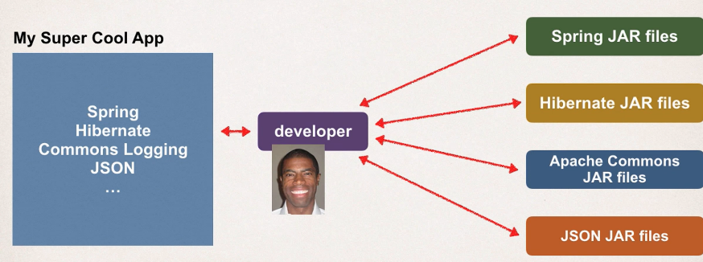

## Spring boot and Maven

maven is projects initializer

## what is Maven

project managment tools

for dependencies

## when to use

when dealing with many JAR files

## maven solution

automatic downlaoder and installation , instead manual process

## Maven - how it works

- read config
- check local repo
- get from remote repo
- save in local repo
- build and run the application

## handling JAR Dependencies

when maven downlaod dependencies, it also donwload what support the dependencies

for example : Spring depend on commos logging

## building and running

- when you build and run app
- maven handle class / build path
- based on config files, maven will add JAR files accordingly
