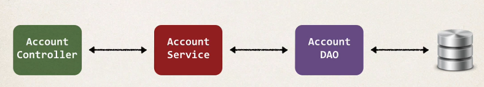
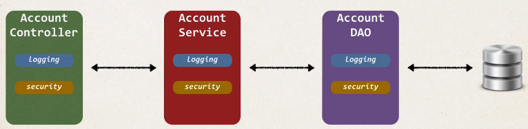

## 346. AOP - The Business Problem


### Application architecture 


#### Code for Data Access Object(DAO) 
```java
public void addAccount(Account theAccount, String userId) {
    
    entityManager.persist(theAccount); 
}
```

#### New requirement - Logging 
* Need to add logging to our DAO methods 
  * Add some logging statements before the start of the method 
* Possibly more places ... but get started on that ASAP !  
**the dreaded "TPS Rerports" ... from movie "Office Space" :-)

#### DAO - Add Loggin Code 
```java
public void addAccount(Account theAccount, String userId) {
    // code for logging
    
    entityManager.persist(theAccount); 
}
```

#### New requirement - security 
* Need to add security code to our DAO 
  * Make sure user is authorized before running DAO method
```java
public void addAccount(Account theAccount, String userId) {
    // code for logging
    
    // code for security check 
    
    entityManager.persist(theAccount); 
}
```

#### By the way 
* Let's add ti to all of our layers 

