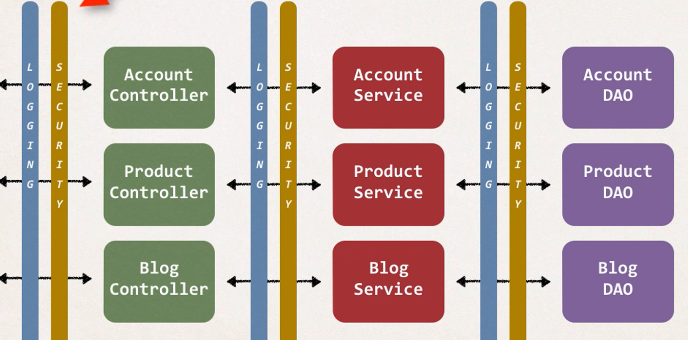
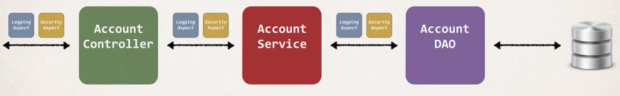

## 347. AOP Solution and AOP Use Cases

### Two main problems 
* code tangling 
  * for a given method : `addAccount(..)`
  * we have logging and secruity code tangled in 
* Code scattering 
  * if we need to change logging or security code 
  * we have to update all classses 

#### Other possible solutions? 
* Inheritance?
  * Every class would need to inherit from a base class 
  * Can all classes extends from your base class? ... plus no multiple inheritance 
* Delegation? 
  * Classes would delegate logging, security calls 
  * Still would need to update classes if we wanted to 
    * add / remove logging or security 
    * add new feature like auditing, API management, instrumentation 

### Aspect-Oriented programming 
* programming technique based on concept of an Aspect 
* Aspect encapsulates cross-cutting logic 
* Cross-Cutting concerns 
  * "Concern" means logic / functionality  
  * 

#### Aspect : 
* Aspect can be reused at multiple locations 
* Same aspect / class ... applied based on configuration 
* 

