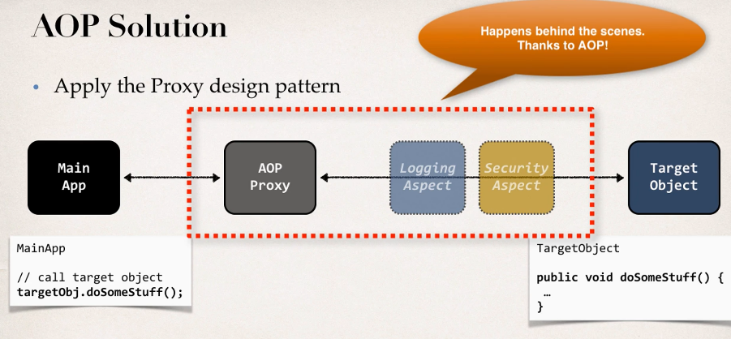

## 348. AOP Concepts and Terminology

### ASP Solution 
* Apply the Proxy design pattern 
* 

#### Benifits of AOP 
* Code for Aspect is defined in a single class 
  * Much better that being scattered everywhere 
  * Promotes code reuse and easier to change 
* Business code in your application is cleaner 
  * Only applied to business functionality : addAccount 
  * Reduces code complexity 
* Configurable 
  * Based on configuration, apply Aspect selectively to different parts of app 
  * No need to make changes to main application code ... very important 

#### Additional AOP Use Cases
* Most common 
  * logging, security, transactions 
* Audit logging 
  * who, what , when, where 
* Exception handling 
  * log exception and notify DevOps team via SMS/email
* API manager 
  * how many times has a method been called user
  * analytics: what are peak times ? what is average load ? who is top user ? 

#### AOP: Advantages and Disadvantages 
Advantages: 
* Reusable modules 
* resolve code tangling 
* resolve code scatter 
* applied selectively based on configuration 

Disadvantages: 
* Too many aspects and app follow is hard to follow 
* Minor performance cost for aspect execution (run-time weaving)

