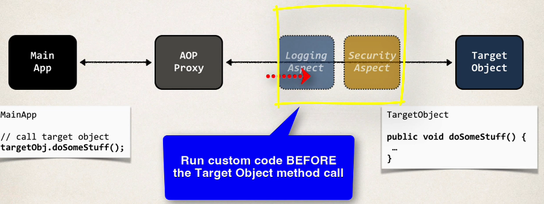
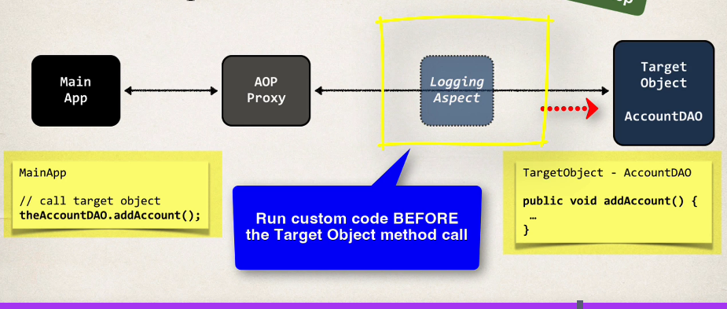

## 351. AOP - @Before Advice - Overview - Part 1

### Advice types :
* Before advice: run before the method
* After finally advice: run after the method (finally)
* After returning advice: run after the method (success execution )
* After throwing advice: run after method (if exception thrown )
* Around advice: run before and after method 

#### @Before advice - Interaction 


#### Advice - Interaction
```java
TargetObject
@Before
public void dosomeStuff() {
    // .... 
    // @AfterReturning 
}
```
* @Before: run custom code Before the target object method call 
* AfterReturning : Run Custom code after the target object method call 

#### @Before Advice - Use Cases 
* Most common : 
  * logging, security, transactions 
  * actually spring do it begine the scenes in `@Transactional` 
* Audit logging
  * who, what, when, where 
* API Management 
  * how many times has a method been called user 
  * analytics: what are peak times? what is average load? who is top user? 

#### AOP Example - Overview 
