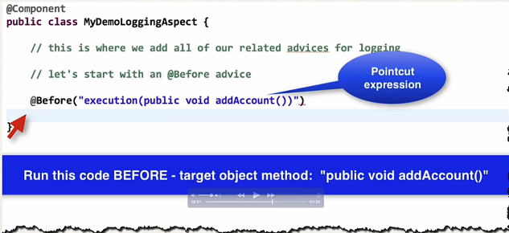

## 357. AOP - Pointcut Expressions - Overview

#### I made a promise to you : 


#### AOP Terminology 
* **Pointcut**: A predicate expression for where advice should be applied 

#### Pointcut Expression Language 
* Spring AOP uses AspectJ's pointcut expression language 
* we will start with execution pointcuts 
  * applies to execution of methods 

#### Match on Method Name 

##### Point Expression Language 
```pointcutexpression
execution(modifiers-pattern? return-type-pattern declaring-type-pattern? method-name-pattern(param-pattern) throws-pattern?)

```
* The pattern is optional if has "?"

#### Pointcut Expression Examples 
Match on method names 
* Match only addAccount() method in AccountDAO class  
```java
@Before("execution(public void com.luv2code.aopdemo.dao.AccountDAO addAccount())")
```
* Match only addAccount() method in any class  
```java
@Before("execution(public void  addAccount())")
```
* Match on method names (using wildcards)
  * match method starting with `add` in any class  
    ```java
    @Before("execution(public void  add*())")
    ```
  * match on methods starting with process `processCreditCard` in any class  
    ```java
    @Before("execution(public VerificationResult processCreditCard*())")
    ```

* use wildcards on return type 
```java
@Before("execution(public * processCreditCard*())")
```

* Modifier is optional ... so you don't have to list it 
```java
@Before("execution(* processCreditCard*())")
```