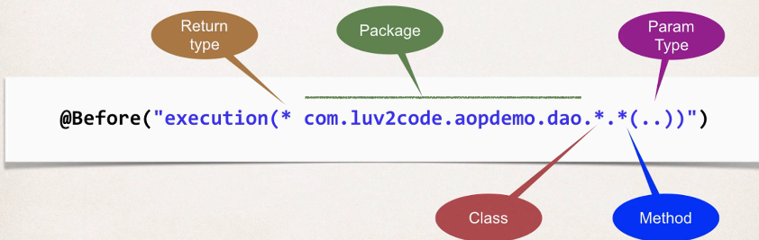

## 363. AOP - Pointcut Expressions - Overview - Match on Method Parameters

### Match on Parameters 
* for param-pattern 
  * ()- matches a method with no arguments 
  * (*) - matches a methdo with one argument of any type 
  * (..) - matches a method wit 0 ro more arguments of any type 

#### Pointcut expression examples 
Match on method **parameters** 
* Match addAccount methods with no arguments 
    ```java
    @Before("execution(* addAccount())")
    ```

* Match **addAccount** methdos that have Account param 
    ```java
    @Before("execution(* addAccount(com.luv2code.aopdemo.Account))")
    ```
* Match addAccount methods with any number of arguments 
    ```java
    @Before("execution(* addAccount(..))")
    ```
  
### Match on package
* Match any method in our DAO package: **com.luv2code.aopdemo.dao
```java
@Before("execution(* com.luv2code.aopdemo.dao.*.*(..))")
```


