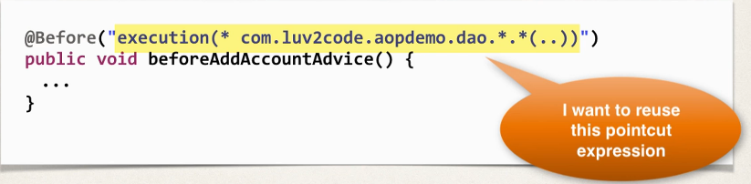

## 368. AOP: Pointcut Declarations - Overview

### Problem 
* how can we reuse a pointcut expression? 
  * want to apply to multiple advices  
  

#### Problem solution 
* Could just do the old copy/paste method ... yuk! 

#### Ideal solution 
* create a pointcut declaration once 
* apply it to multiple advices 

### Development process
1. create a pointcut declaration once
2. apply it to multiple advices

#### Step 1. create a pointcut declaration once
```java
@Pointcut("execution(* com.luv2code.aopdemo.dao.*.*(..))")
private void forDaoPackage() {} 
```
* `forDaoPackage`: name of pointcut declaration 
  * cna have any name 

```java
@Aspect
@Component 
public class MyDemoLoggingAspect {

    @Pointcut("execution(* com.luv2code.aopdemo.dao.*.*(..))")
    private void forDaoPackage() {}
    
    @Before("forDaoPackage()")
    public void beforeAddAccountAdvice() {
        
    }

    @Before("forDaoPackage()")
    public void performApiAnalytics() {

    }
}
```

#### Benefits of Pointcut Declarations 
* Easily reuse pointcut expressions 
* update pointcut in one location
* can also share and combine pointcut expressions (coming up later) 

