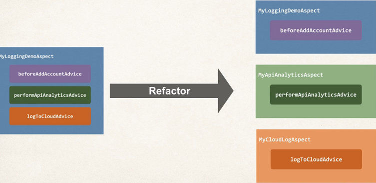
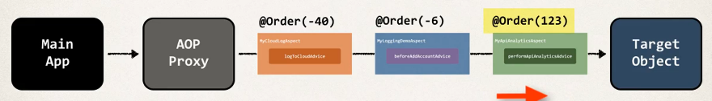

## 374. AOP: Ordering Aspects - Overview

### Problem 
* How to control the order of advices being applied? 
  * MyloggingDemoAspect
    * beforeAddAccountAdvice
    * performApiAnalyticsAdvice
    * logToCloudAdvice
* the order is undefined 

#### To control order 
* Refactor: place advices in separate Aspects 
* Control order on Aspects using the @Order annotation 
* Guarantee order of when Aspects are applied 

### Development Process 
1. Refactor: Place advices in separate Aspects
2. Add @Order annotation to Aspects 

#### Step 1. Refactor: Place advices in separate Aspects


#### Step 2. Add @Order annotation to Aspects
* control order on Aspects using the `@Order` annotation 
```java
@Order(1) 
public class MyCloudLogAspect {
    
}
```
* guarantees order of when Aspects are applied 
* Lower numbers have higher precedence 

#### @Order 
* we want the following order 
1. MyCloudLogAspect
2. MyLoggingDemoAspect
3. MyApiAnalyticsAspect 

#### @Order annotation 
```java
@Aspect
@Component 
@Order(1)
public class MyCloudLogAspect { 
    
}
```
```java
@Aspect
@Component 
@Order(2)
public class MyLoggingDemoAspect { 
    
}
```
```java
@Aspect
@Component 
@Order(3)
public class MyApiAnalyticsAspect { 
    
}
```

* Lower numbers have higher precedence 
  * Range Integer:MIN_VALUE to Integer.MAX_VALUE
  * Negative numbers are allowed 
  * Does not have to consecutive

* Example with negative numbers : 


* FAQ: What if aspects have the exact same **@Order annotation**? 
```java
@Order(1)
public class MyCloudAspect { 
    
}
@Order(6)
public class MyShowAspect {

}
@Order(6)
public class MyFunnyAspect {

}
@Order(123)
public class MyLoggingDemoAspect {

}
```
* the order at this point is udefined 
  * will still run after `MyCloudAspect` and before `MyLoggingDemoAspect`

