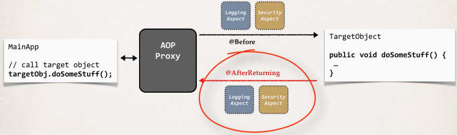
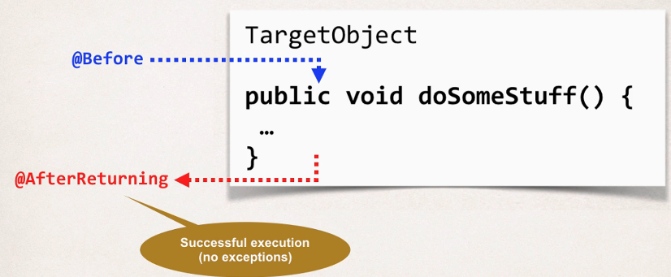

## 382. AOP: @AfterReturning Advice - Overview

### Advice types : 
* ....
* After returning advice: run after the method (success execution)
* ....

#### @AfterReturning Advice - Interaction 



#### Advice - Interaction 


#### @AfterReturningAdvice - Use Cases 
* Most common 
  * logging, security, transactions 
* Audit logging 
  * who, what, when, where 
* Post-processing Data
  * Post process the data before returning to caller 
  * Format the data or enrich the data (really cool but be careful)

#### Example 
* Create an advice that will run after a method call (success execution)
```java
//Target Object
//AccountDAO 
List<Account> findAccounts() 
```

#### @After ReturningAdvice 
* This advice will run after the method call (success execution) 
```java
@AfterReturning("execution(* com.luv2code.aopdemo.dao.AccountDAO.findAccounts(..))")
public void afterReturningFindAccountsADvice() {

    System.out.println("Executing AfterReturning advice");
}
```

#### Access the REturn value 
* need to access the return value of method called 
* to log this value 
```java
@AfterReturning(
        pointcut="execution(* com.luv2code.aopdemo.dao.AccountDAO.findAccounts(..))",
        returning="result" // parameter name 
)
public void afterReturningFindAccountsADvice(JoinPoint theJoinPoint, List<Account> result) {
    
    // print out the results of the method call 
    System.out.println("\n======>>>>> result is: " + result);
}
```