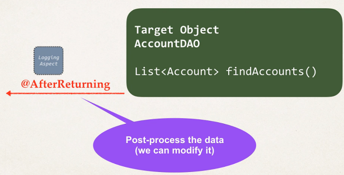

## 386. AOP: @AfterReturning Advice - Modify Return Value - Overview

### @AfterRetuning Advice - Use Cases
* Post-processing Data
  * Post process the data before returning to caller 
  * Format the data or enrich the data (really cool but be careful)

#### Post-Processing / Modify Data 


#### Modify the Return Value 
```java
@AfterReturning(
        pointcut = "execution(* com.luv2code.aopdemo.dao.AccountDAO.findAccounts())",
        returning = "result"
)
public void LogAfterReturningAdvice(JoinPoint joinPoint, List<Account> result) {

    // modify "result" list: add, remove, update, etc ... 
    if(!result.isEmpty()){
        Account tempAccount = result.get(0);
        tempAccount.setName("Daffy Duck");
    }
    
    
    
}
```

#### Calling the program 
```java
// call method to find the accounts 
List<Account> theAccounts = theAccountDAO.findAccounts(); 
```
* this is really call, but be careful 
* Your development team should be aware of AOP being used in app 
* 