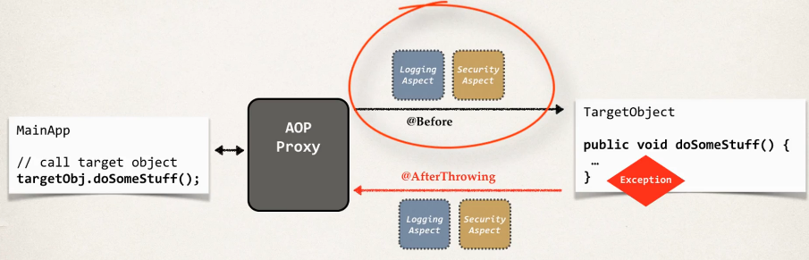
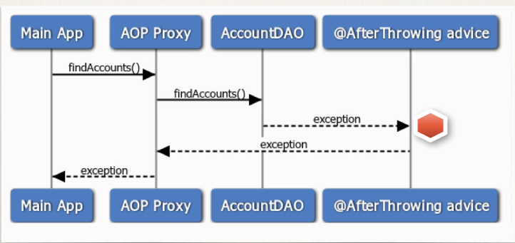

## 388. AOP: @AfterThrowing Advice - Overview

### Advices types 
* ... 
* After throwing advice: run after method (if exception thrown)

#### @AfterThrowing Advice - Interaction 


#### Sequence Diagram


#### AfterThrowingAdvice - User Cases
* Log the exception 
* Perform auditing on the exception 
* Notify DevOps team via email or SMS 
* Encapsulate this functionality is AOP aspect for easy reuse 

#### Example : 
* Create an advice that will run after an exception is thrown 

#### @AfterThrowingAdvice
* this advice will run after an exception is thrown 
```java
@AfterThrowing("execution(* com.luv2code.aopdemo.dao.AccountDAO.findAccounts(..))")
public void afterThrowingFindAccountsAdivce() {

    System.out.println("Executing @AfterThrowing advice");
}
```

#### Access the Exception 
```java
@AfterThrowing(
        pointcut="execution(* com.luv2code.aopdemo.dao.AccountDAO.findAccounts(..))",
        throwing="theExc")
public void afterThrowingFindAccountsAdivce(JoinPoint theJoinPoint, Throwable theExc) {
    
    // log the exception 
    System.out.println("\n====>>>>> the exception is: " + theExc);
}
```

#### Exception Propagation 
* At this point, we are only intercepting the exception (reading it)
* However, the exception is sill propagated to calling program

#### Exception propagation 
* if you want to stop the exception propagation 
  * then use the @Around advice
  * covered in later videos  
