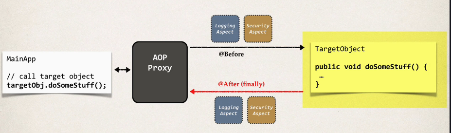
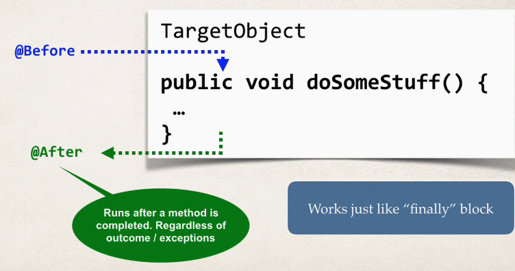
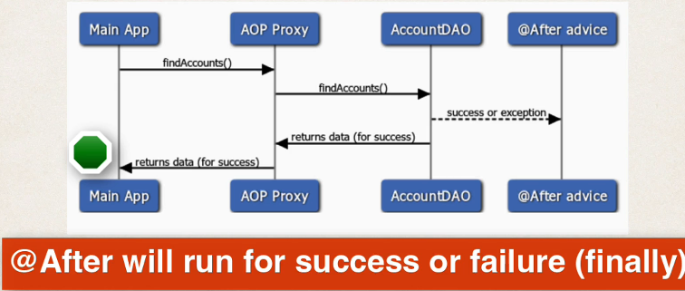

## 391. AOP: @After Advice - Overview


### After finally advice : run after the method (finally)



#### Advice - Interaction 


#### Sequence diagram 


#### @After advice - Use Cases
* Log the exception and / or perform auditing 
* Code to run regardless of method outcome 
* Encapsulate this functionality in AOP aspect for easy resue 

#### Example 
* Create an advcie to run after the method (finally ... success / failure ) 
```java
@After("execution(* com.luv2code.aopdemo.dao.AccountDAO.findAccounts(..))")
public void afterFinallyFindAccountsAdvice() {

    System.out.println("Executing @After (finally) advice");
}
```

#### @After Advice - Tips 
* The @After advice does not have access to the exception 
  * if you need exception, then use @AfterThrowing advice 
* The @After advice should be able to run in the case of success or error 
  * Your code should not depend on happy path or an exception 
  * Logging / auditing is the easiest case here 

