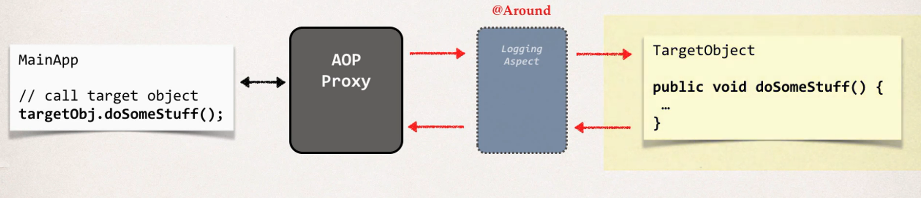
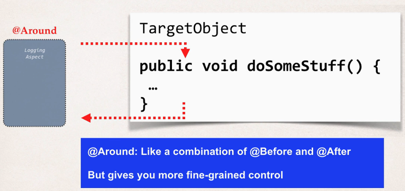
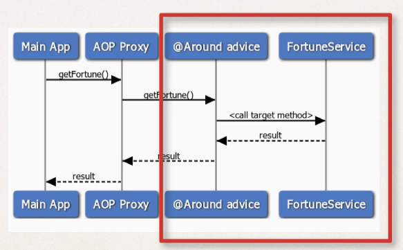

## 393. AOP: @Around Advice - Overview

#### Around advice: run before and after method 


#### Advice - Interaction 


#### @Around Advice - Use Cases 
* Most common: logging, auditing, security
* Pre-processing and post-processing data
* Instrumentation / profiling code 
  * How long does it take for a section of code to run ? 
* Managing exceptions
  * Swallow / handle / stop exceptions 

#### Our FortuneService Example - Revisited 


#### ProceedingJoinPoint
* when using @Around advice 
* you will get a reference to a **"proceeding join point"** 
* This is a handle to the **target method**
* Your code can use the **proceeding join point** to execute **target method**

#### Example : 
* Create an advice for instrumentation / profiling code 
  * How long does it take for a section of code to run? 

#### @Around Advice 
```java
@Around("execution(* com.luv2code.aop....)")
public Object afterGetFortune(
        ProceedingJoinPoint theProceedingJoinPoint) throws Throwable {
    // get begin timestamp 
    long begin = System.currentTimeMillis(); 
    
    // now, lets execute the method 
    Object  result = theProceedingJoinPoint.proceed(); 
    
    // get end timestamp 
    long after = System.currentTimeMillis();
    
    // compute duration and display it 
    long duration = end - begin ;
    System.out.println("\n==========> Duration: " + duration + " milliseconds");
}
```
