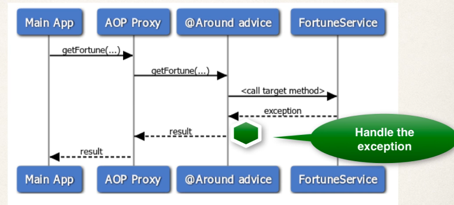

## 397. @Around Advice - Handle Exception - Overview

#### ProceedingJoinPoint - Revisited 
* for an exception thrown from proceeding joinpoint 
  * you can handle / swallow / stop the exception 
  * or you can simply rethrow the exception 
* this gives you fine-grained control over hwo the target method is called 

#### Sequence Diagram 


#### Handle Exception 
```java
@Around(".... ")
public Object afterGetFortune(
        ProceedingJoinPoint pjp
) throws Throwable {
    
    Object result = null; 
    
    try {
        // let's execute the method 
        result = pjp.proceed(); 
    } catch(Exception e) {
        
        // log the exception 
        System.out.println("@Around advice: we have a problem " + e);
        
        // handle and give default fortune ... use this approach with caution 
        result = "Nothing exciting here. Move along!"; 
        
    }
    
    return result; 
}
```
* the calling program will never know exception happened 
* Use with aution ...depends on your app 
  * here you can assign a new value 
  * or rethrow new exception 
