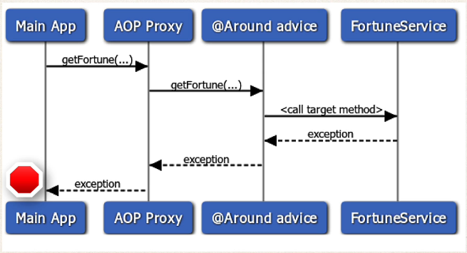

## 400. AOP: @Around Advice - Rethrow Exception

#### ProceedingJoinPoint - Revisited 
* in this video we will focus on rethrowing the exception 

#### Sequence diagram 


#### Rethrow exception 
```java
@Around("execution(* com.luv2code.aopdemo.services.TrafficFortuneService.getFortune(..))")
public Object aroundGetFortune(ProceedingJoinPoint pjp) throws Throwable {

    // time begin
    long begin = System.nanoTime();

    // executing the function
    Object result = null;

    try{
        result = pjp.proceed();
    } catch (Exception e) {

        // log the exception
        System.out.println("aroundGetFortune exception : " + e);

        // rethrow the exception 
        throw e; 
    }


    long end = System.nanoTime();

    long duration = end - begin;

    System.out.println("Measured method ("+ pjp.getSignature().toShortString() +")");
    System.out.println("\n========> Duration : " + duration + " nano seconds");

    return result;
}

```
2. move to main application, and comment out the previous code 
3. add new method 

```java
private void demoThearoundAdviceRethrowException(TrafficFortuneService theTrafficFortuneService) {
    
    // copy and paste from the previous code : 

    System.out.println("\nMain Program: demoTheAroundAdviceHandleException ");

    System.out.println("\nCalling getFortune()");

    boolean tripWire = true;
    String data =  theTrafficFortuneService.getFortune(tripWire);

    System.out.println("\nMy fortune is : " + data);

    System.out.println("Finished");
    
}
```
4. run and see the results 
