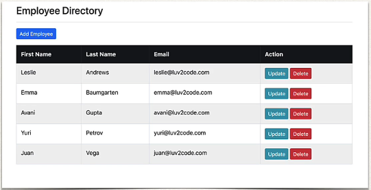
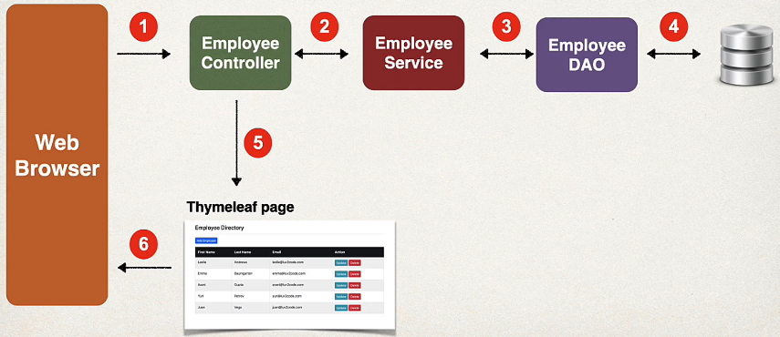
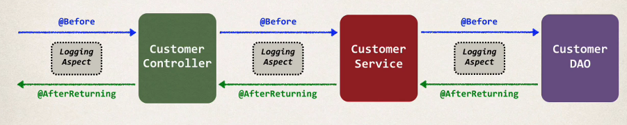
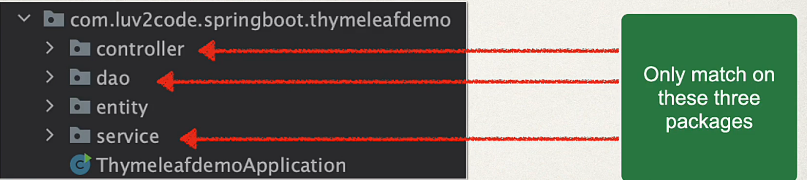

## 401. AOP: Integrating AOP with Spring MVC CRUD App - Overview

### Goal 
* Add AOP Logging support to our Spring MVC CRUD app 


#### Big picture 


#### Logging Aspect 


### Development Process 
1. Add Spring boot AOP starter to maven pom file 
2. Create Aspect
   1. add logging support 
   2. setup pointcut declarations 
   3. add @Before advice 
   4. add @AfterReturning advice 

#### Step 1 : Add Spring boot AOP starter to maven pom file 
* Add the dependency fo Spring Boot AOP Starter 
```xml
    <artifactId>spring-boot-starter-aop</artifactId>
```
* since this dependency is part our pom.xml 
  * spring boot will automatically enable support for AOP 

#### Step 2 :
2. Create Aspect
    1. add logging support
    2. setup pointcut declarations
    3. add @Before advice
    4. add @AfterReturning advice
    
#### Packages structure : 


