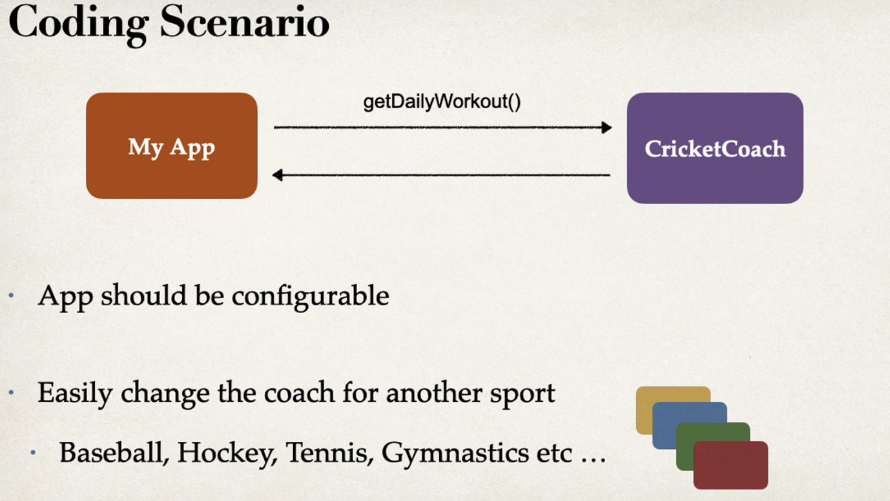
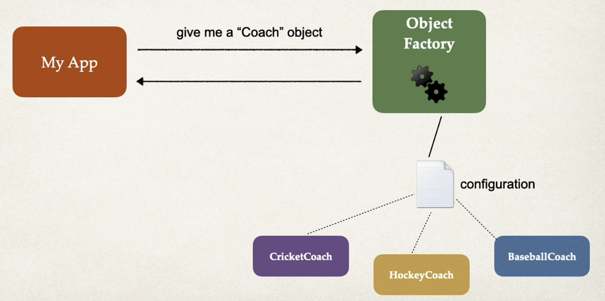

## Inversion of Control (IoC)
the approach of outsourcing the construction and management of objects

## Coding Scenario

My App -> <- cricketCoarch
* App should be configurable
* Easily hcange the coach for another sport
  * Baseball, hockey, tennisn, gymnastics etc.

## Ideal Solution 

## Spring Container 
* Primary functions 
  * Create and manage objects (Iversion of Control)
  * Inject object dependencies (Dependency Injection)

## Configuring Spring Container
* XML configuration (legacy)
* Java Annotations (modern)
* Java soruce code (modern)
* 
