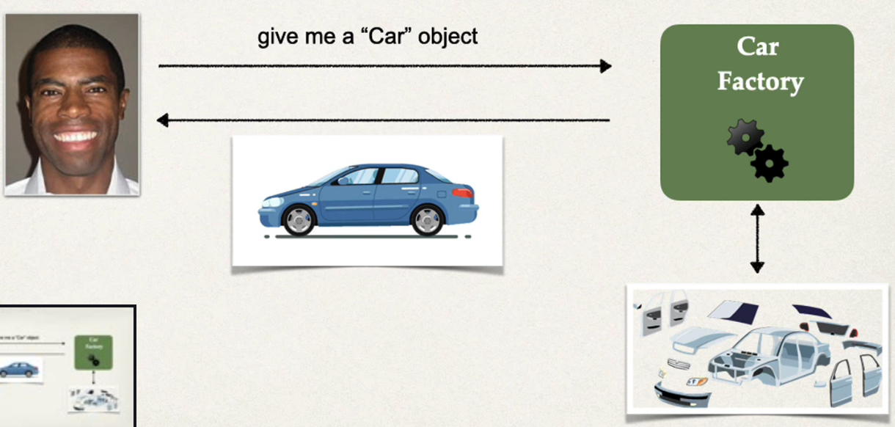
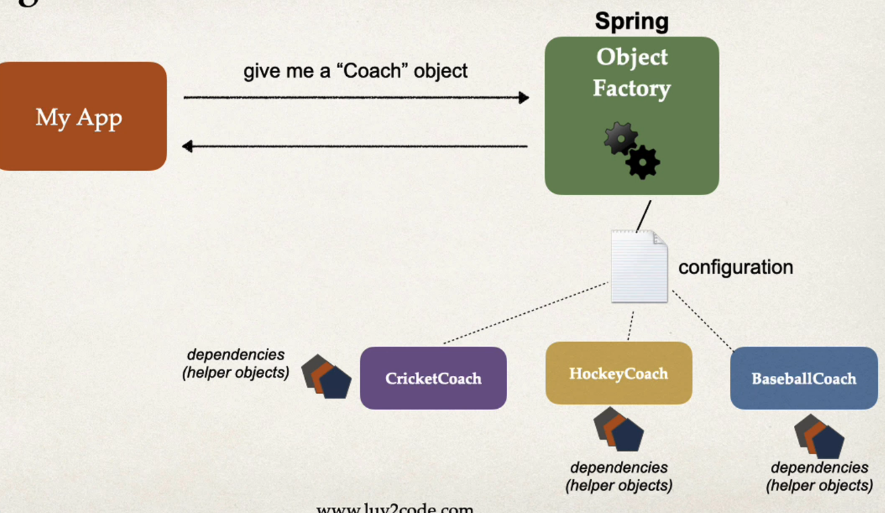
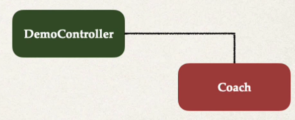

## Dependency Injection
The dependency inversion principle
The client delegates to another object the responsibility of providing its dependencies

## Car Factory examples

## Spring Container 

### Primary functions  :
* create and manage objects (Inversion of Control)
* Injec object`s dependencies (Dependency Injection)

## Demo Example
* coach provides daily workouts
* The DemoController wants to use a Coach
  * new helper: Coach
  * This is a **dependency**
* Need to inject this dependency

## Injection Types 
* There are multiple types of injection with Spring
* we will cover the two recommended types of injection 
  * Constructor Injection
  * Setter Injection 

## Injection Types - Which one to use ? 
* Constructor Injection
  * use when you have required dependencies 
  * Generally recommended by the spring.io development team as first choice
* Setter Injection
  * Use when you have optional dependencies
  * if dependency is not provided, your app can provice reasonable default logic 

## What is Spring AutoWiring 
* For dependency injection, Spring can use autowiring
* Spring will look for a class that matches
  * matches by type : class or interface 
* Spring will inject it automatically ... hence it is autowired

### Auto wiring exmaple 
* Injecting a Coach implementation
* Spring will scan for @Components 
* Any one implements the Coach interface???
* If so, let`s inject them. For example: CricketCoach

