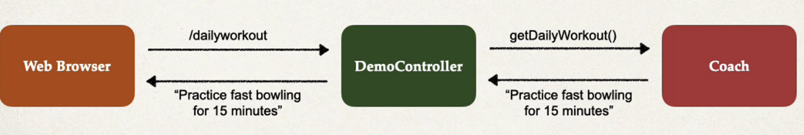

## Example Applicatoin



## Development Process - Constructor Injection
1. Define the dependency interface and class
2. Create Demo REST Controller
3. Create a constructor in your class for injection
4. Add @GetMapping for /dailyworkout

### Step 1: Define the dependency interface and class

_File: Coach.java_
```java
package com.luv2code.springcoredemo;

public interface Coach {
    String getDailyWorkout(); 
}
```

_File: CricketCoach.java_
```java
package com.luv2code.springcoredemo;

import org.springframwork.stereotype.Component; 

@Component
public class CricketCoach implements Coach {
    @Override
    public String getDailyWorkout() {
        return "Practice fast bowling for 15 minutes"; 
    }
}
```

#### @Component annotation
* @Component marks the class as s Spring Bean
  * A Spring Bean is just a regular Java class that is managed by Spring 
* @Component also makes the bean available for dependency injection 

### Step 2: Create Demo REST Controller
_File: DemoController.java_
```java
package com.luv2code.springcoredemo;

import org.springframwork.web.bind.annotation.RestController; 

@RestController
public class DemoController {
    
}
```

### Step 3: Create a Contructor in your class for injections
_File: DemoController.java_
```java
package com.luv2code.springcoredemo;

import org.springframwork.web.bind.annotation.RestController; 
import org.springframework.beans.factory.annotation.Autowired; 
@RestController
public class DemoController {
    
    private Coach myCoach;
    
    @Autowired
    public DemoController(Coach theCoach) {
        myCoach = theCoach; 
    }
}
```

* if you only have one constructor then @Autowired on constructor is optional
* @Autowired annotation tells Spring to inject a dependency 
* At the moment, we only have one Caoch implementation CricketCaoch
  * Spring can figure this out 
  * Later in the course we will cover  
  the case of multiple Caoch implementations 

### Step 4: Add @GetMapping for /dailyworkout
_File: DemoController.java_
```java
package com.luv2code.springcoredemo;

import org.springframwork.web.bind.annotation.RestController; 
import org.springframework.beans.factory.annotation.Autowired; 
@RestController
public class DemoController {
    
    private Coach myCoach;
    
    @Autowired
    public DemoController(Coach theCoach) {
        myCoach = theCoach; 
    }
    
    @GetMapping("/dailyworkout")
    public String getDailyWorkout() {
        return myCoach.getDailyWorkout(); 
    }
}
```