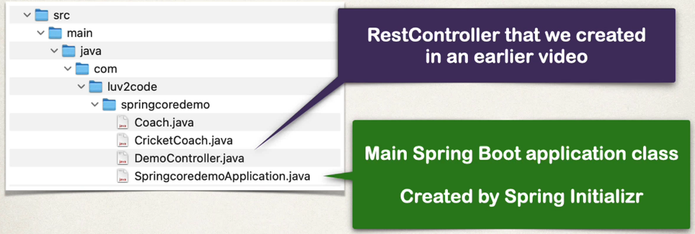
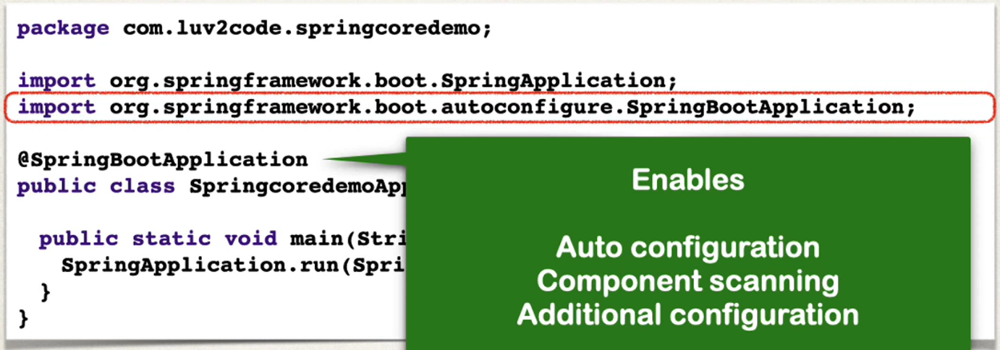
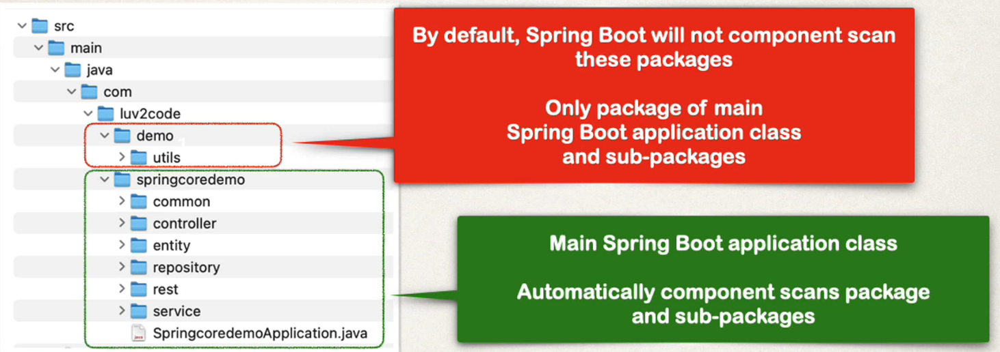
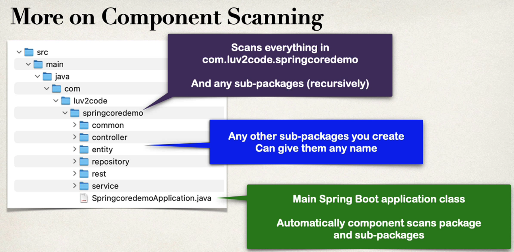
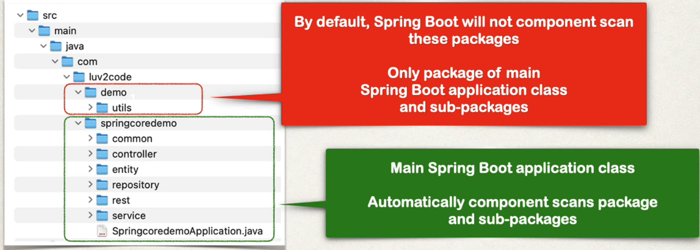
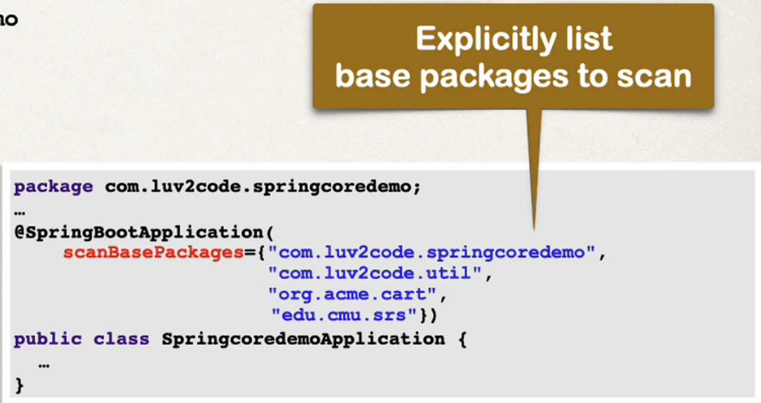

## Scanning for Component Classes 
* Spring will scan your Java classes for special annotations
  * @Component, etc
* Automatically register the beans in the Spring container 

## Java Source Code


**File: SpringcoredemoApplication.java**


### Annotations : 
* **@SpringBootApplication** is composed of the following annotaitons:  

| Annotation               | Description                                                                       |
|--------------------------|-----------------------------------------------------------------------------------|
| @EnableAutoConfiguration | Enables Spring Boot's auto-configuration support                                  |
| @ComponentScan           | Enables component scanning of current package Also recursively scans sub-packages |
| @Configuration           | Able to register extra beans with @Bean or import other configuration classes     |


```java
    package com.luv2code.springcoredemo;
    
    import org.springframework.boot.SpringApplication;
    import org.springframework.boot.autoconfigure.SpringBootApplicatoin;
    
    @SpringBootApplication
    public class SptringcoredemoApplication{
        public static void main(String [] args) {
            SpringApplication.run(SpringdemoApplication, args); 
            
        }
    }
```
* **notes of the code block** 
  * SpringApplication : Bootstarp your Spring Boot applicaiton
  * Behind the scenes 
    * create application context, and register all beans 
    * Start the embedded server Tomcat etc...

## More on Component Scanning 
* by defualt, Sptring boot starts component scanning
  * from the same package as your main **Sptring boot application**
  * Also scans sub-packages recursively
* This implicitly defines a  base search package 
  * allows you to leverage default component scanning
  * no need to explicitly reference the base package naem 

### Example of scanning





## Common Pitfall - Different location



## More on Comonent Scanning 
* Defualt scanning is fine if everything is under 
  * **com.luv2code.springcoredemo**
* But what about other packages outside ? 
  * what you can do **Explicitly list base package to scan**
  * 

