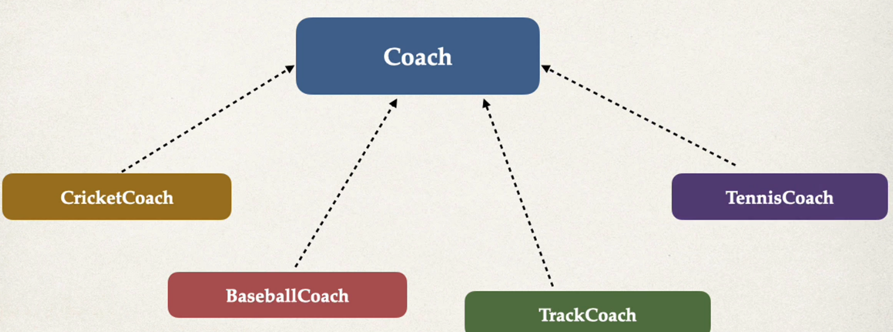
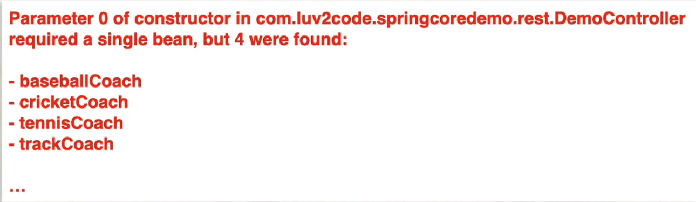

## Annotation Autowiring and Qualifiers

### Autowiring 
* Inject a Coach implementation
* Spring will scan @Components 
* Any one implements Coach interface ??? 
* if so, let's inject them... **oops which one?**

### Multiple Coach Implementation 

Coach
* CircketCoach
```java
package com.lov2code.springcoredemo.common;
import org.springframework.sterotype.Component;

@Component
public class CricketCoach implements Coach {
    @Override
    public String getDailyWorkout() {
        
    }
}
```
* BaseballCoach
```java
package com.lov2code.springcoredemo.common;
import org.springframework.sterotype.Component;

@Component
public class BaseballCoach implements Coach {
    @Override
    public String getDailyWorkout() {
        
    }
}
```
* TrackCoach
```java
package com.lov2code.springcoredemo.common;
import org.springframework.sterotype.Component;

@Component
public class TrackCoach implements Coach {
    @Override
    public String getDailyWorkout() {
        
    }
}
```
* TennisCoach
```java
package com.lov2code.springcoredemo.common;
import org.springframework.sterotype.Component;

@Component
public class CricketCoach implements Coach {
    @Override
    public TennisCoach getDailyWorkout() {
        
    }
}
```

#### well, we have a little problem
error message : 


### Solution : Be specific! - @Qualifier
#### for constructor injection 
```java

@RestController
public class DemoController {
    
    private Coach myCoach;
    
    @Autowired
    public DemoController(@Qualifier("cricketCoach") Coach theCoach) {
        myCoach = theCoach;
    }
    
    @GetMapping("/dailyworkout")
    public String getDailyWorkout() {
        return myCoach.getDailyWorkout(); 
    }
```
#### for setter injection
```java

@RestController
public class DemoController {
    
    private Coach myCoach;
    
    @Autowired
    public void setCoach(@Qualifier("cricketCoach") Coach theCoach) {
        myCoach = theCoach;
    }
    
    @GetMapping("/dailyworkout")
    public String getDailyWorkout() {
        return myCoach.getDailyWorkout(); 
    }
```
