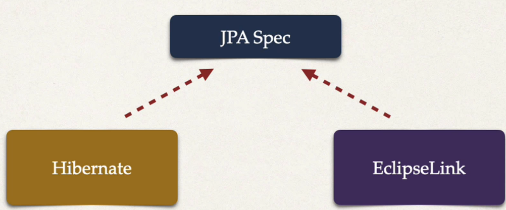
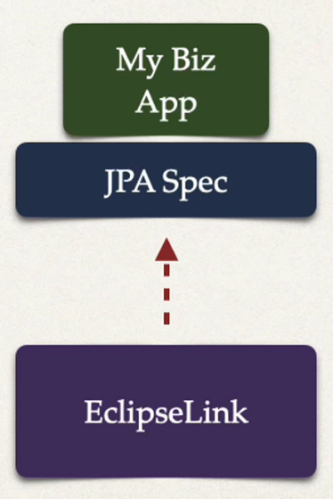
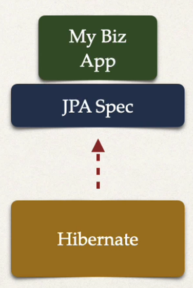

## 60. Hibernate / JPA Overview

### Topics
* What is Hibernate? 
* Benefits of Hibernate
* What is JPA?
* Benefits of JPA
* Code Snippest

### What is Hibernate ? 
* A framework  for presisting / saving Java objects in a database
  * www.hibernate.org/orm

### Benefits of Hibernate
* Hibernate handles all of the low-level SQL
* Minmizes the amount of JDBC code you ahve to develop
* Hibernate provides the **Object-to-RElational** Mapping (ORM)

### Object-To-Relational Mapping (ORM)
* The developer defines mapping between Java class and database table
* you can save the configuration using : `XML`, `Java annotation`

### What is JPA
* Jakarta Persistence API(JPA) .. previously as Java Persistence API
  * Standar API for Object-to_Rlelational-Mapping(ORM)
* Only a specification 
  * Defines a set of interfaces
  * required an implementation to be usable 

### JPA - Vendor Implementations 


* first we need to set of interfaces , given from `JPA Spec`
* and implementations to the interfaces
  * Hibernate
  * EclipseLink
* for more [www.luv2code.com/jpa-vendors](www.luv2code.com/jpa-vendors)

### What are Benefits of JPA ? 
* By having standard API, you are not locked to vendor's implementations 
* Maintain protable, flexible code by coding to JPA spec (interface)
* Can theorertically switch vendor implementations 
  * for example, if Vendor ABC stops supporting their product
  * You could switch to Vendor XYZ without vendor lock in 

### JPA - Vendor Implementations 

easily swap to anotehr implementations 


### Saving a Java Object with JPA 
* create java object
* then save to database
  * Use special JPA helper ojbect `entityManager`
  * in background , the data will be stored in the database
    ```java
    //create Java object
    Student theStudent = new Student("Pual", "Doe", "paul@luv2code.com");
    
    // save it to database
    entityManager.presist(theStudent);
    ```
* if you **remember** old days of JDBC ...  
you would have to manually write the SQL code

### Retrieving a Java Object with JPA
* there are different ways to retrieve objects 
```java
//create Java object
Student theStudent = new Student("Pual", "Doe", "paul@luv2code.com");

// save it to database
entityManager.presist(theStudent);

// now retrieve from database using the primary key
int theId = 1;
Student myStudent = entityManager.find(Student.class, theId); 
```

### Querying for Java Objects 
* JPA has a languate of quiries 
```java
TypedQuery<Student> theQuery = entityManager.createQuery("from Student", Student.class);
List<Student> students= theQuery.getResultList(); 
```

### JPA/Hibernate CRUD Apps 
* Create objects
* Read objects 
* Update objects
* Delete objects

