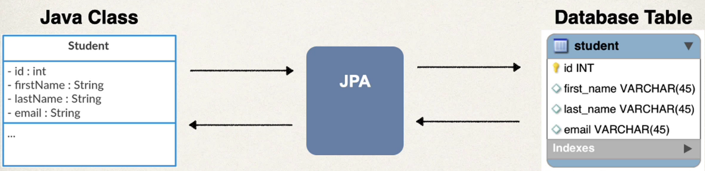

## 68. JPA Annotations - Overview

### JPA Development Process

### JPA Development Process - To DO List
1. Annotate Java Class
2. Develop java Code to perform database operations 

### Let's just say "JPA"
* as mentioned, Hibernate is teh defualt JPA implementation in Spring Boot
* Going forward in this course, I will simply use the term: **JPA**
  * Instead of saying "JPA Hibernate"
* We know that by defualt, Hibernate is used behind the scenes 

### Terminology 
**Entity Class**
Java class that is mapped to a database 
**Primary Key**
* Uniquely identifis each row in a table 
* Must be a unique value 
* cannot contain NULL values 

### Object Relational Mapping (ORM)


### Entity Class 
* At a minimum, the Entity class 
  * Must be annotated with **@Entity**
  * Must have a public or protected no-argument constructor
    * The class can have other constructors

#### Constructors in Java - Refresher 
* Remember about constructs in java
* If you don't declare any constructors 
  * will provide default one 
* if you **declare** constructor 
  * you will not get **free** constructor 

### Java Annotations 
#### Step1: Map class to database table 
* we have class student, we have database table student , with common fields :  
id, firstName, lastName, email
```java
@Entity
@Table(name="student")
public class Student{
    
}
```
#### Step 2: Map fields to database columns 
```java
@Entity
@Table(name="student")
public class Student{
    @Id
    @Column(name="id")
    private int id;
    
    @Column(name="first_name")
    private String firstName; 
    
}
```

### @Column - Optional 
* Actaully, the use of @Column is opotioanl 
* if not specified, the column name is the same name as Java field
* In general, Idon't recommend this approach
  * if you refactor the fava code, then it will not match existing database columns 
  * this is a breakign change and you will need toupdate database column 
* Same appliet to @Table, database table name is same as the class 

### Auto Increment ID script 
```postgresql
CREATE TABLE student (
    id          SERIAL PRIMARY KEY,  -- auto‑incrementing integer (alias for a sequence)
    first_name  VARCHAR(50)  NOT NULL,
    last_name   VARCHAR(50)  NOT NULL,
    email       VARCHAR(100) NOT NULL UNIQUE
);
```

### JPA Identity - Primary Key 
```java
@Entity
@Table(name="student")
public class Student {
    @Id 
    @GenerateValue(strategy=GenerationType.IDENTITY)
    @Column(name="id")
    private int id; 
}
```
* @GenerateValue : this id will be generated by the database  
no need to manually keep tracking that value 

#### ID generation Strategies 
| Name                    | Description                                                                       |
|-------------------------|-----------------------------------------------------------------------------------|
| Generation.Auto         | Pci an appropriate strategy for the particular database                           |
| GenerationType.IDENTITY | Assign primary keys using database identity columns                               |
| GenerationType.TABLE    | Assign prmary keys using an underlying database table to ensure uniqueness        |
| GenerationType.UUID     | Assign prmary keys using a globally unique identifier (UUID) to ensure uniqueness |

* **Recommended** : GenerationType.IDENTITY 

### Bonus Bonus 
* you can define your custom generation id 
* create implementation org.hibernate.id.identifierGenerator
* override the method `public Serializable generate(...)`

