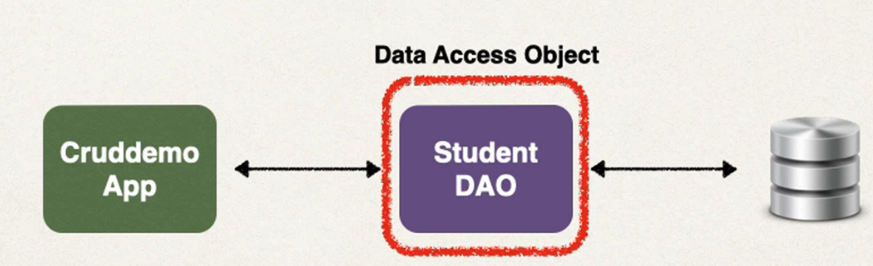
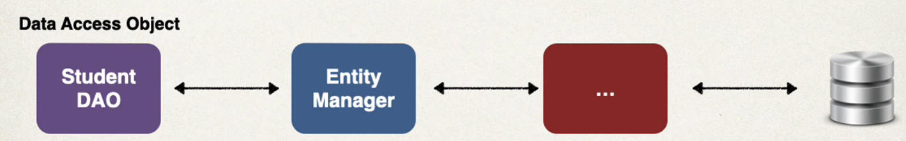
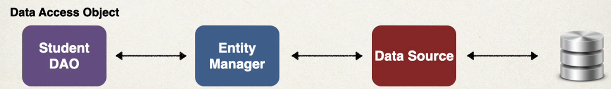

## 70. Saving a Java Object with JPA - Overview - Part 1

### Sample App features 
* Create a new Student
* Read
* Update
* Delete

simple it is **CRUD** 

### Studnet Data Access Object
* Responsible for interfacing with the database
* this is common design pattern : Data Access Object (DAO)

* Methods : 
  * save
  * findByid
  * findAll
  * update
  * delete
  * deleteAll
* we will impelment all of these method in incoming videos 

* Our DAO needs a JPA Entity Manager 
* JPA Entity Manager is the main component for saving/retieving entities 

### JPA Entity Manager
* Our JPA Entity Manager needs a Data Source
* The Data Source defines database connection info 
* JPA Entity Manager and Data Source are automatically created by Spring Boot
  * Based on the file : `application.properties`  
  JDBC URL, user id, ... 
  * We can autowire/inject the JPA Entity Manager into our Student DAO
  

### What about JpaRepository??? 
* Stpring Data JPA has a JpaRepository interface
* this provides JPA database access with minimal coding 

#### Which One EntityManager or JpaRepository???
Answer 
* Yes, we will use JpaRepository in this course 
* we will cover it later in the course
* in this course, I want to show you variaous techniques for using JPA
* Knowing BOTH EntityManager and JpaRepository will heop you on future projects
* Don't worry ... we'll cover both :-)

### In Simple Terms 
* If you need **low-level control and flexibility** , use **EntityManager**
* if you watn **high-level of abstration** then use `Jpa Repository`

#### Use Case 
Entity Manager 
* Need low-level control over the database operations and want to write custom queries 
* Provides low-level access to JPA and work directly with JPA entities 
* Complex queries that required advanced features such as native SQL queries or stored procedures calls 
* When you have custom requirements that are not easily handled by higher-level abstraction 

JpaRepository
* Provides commonly used CRUD operaitons out of the box, reudcing amount of code you need to write 
* Additional features such as pagination, soring
* Generate queries based on method names 
* Can aslo create custom queries using `@Query`

### My Reccommendation
* Choice depends on the application requirements and developer preference
* You can also use both in the same project 
* For **learning purposes** start with EntityManager then learn JpaRepository
* This will help you understand the low-level coding behind the scenes
* Knowing BOTH EntityManager and JpaRepository will help you on future projects 

