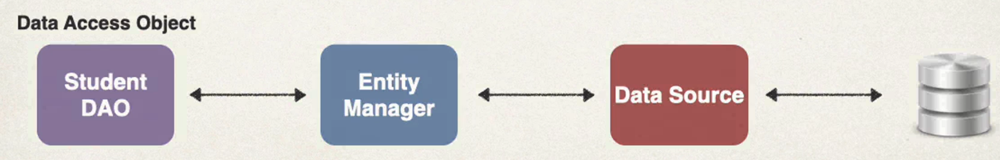
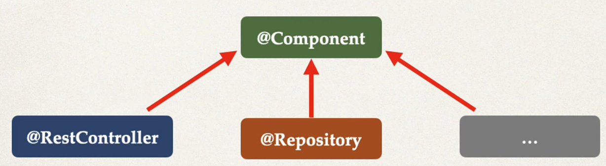

## 71. Saving a Java Object with JPA - Overview - Part 2

### Student DAO
1. Define DAO interface
2. Define DAO implementation
   * Inject the entity manager 
3. Update main app


#### Step 1: Define DAO interface 
```java
public interface StudentDAO {
    void save(Student theStudent); 
}
```
* Student is java class (JPA entity)

#### Step 2: Define the DAO implementation 
```java
public class StudentDAOImpl implements StudentDAO {
    private EntityManageer entityManager; 
    
    @Autowired
    public StudentDAOImpl(EntityManager theEntityManager) {
        entityManager = theEntityManager; 
    }
    
    @Override 
    public void save(Student theStudent) {
        entityManager.persist(theStudent); 
    }
}
```

##### Spring @Transactional
* Spring prvides an **@Transactional** annotation 
* **Automatically** begin and end a transaction for you JPA code
  * No need for you to explicitly do this in your code
* This Spring magic happens behind 
* by adding the **annotation** on the actual method : 
```java
    @Override 
    @Transactional
    public void save(Student theStudent) {
        entityManager.persist(theStudent); 
    }
```

##### Specialized Annotation for DAOs 
* Spring provides **@Repository** annotation 

* Applied to DAO impelementations 
* Spring will automatically register the DAO implementation 
  * thatnk to component-scanning
* Spring also provides translation of any JDBC related exceptions 
  * convert from checked exceptions to unchecked exceptions 

```java
@Repository
public class StudentDAOImpl implements StudentDAO {
    private EntityManageer entityManager; 
    
    @Autowired
    public StudentDAOImpl(EntityManager theEntityManager) {
        entityManager = theEntityManager; 
    }
    
    @Override 
    public void save(Student theStudent) {
        entityManager.persist(theStudent); 
    }
}
```

#### Step 3: Update main app

```java
@Bean
public CommandLineRunner commandLineRunner(StudentDAO studentDAO) {
    return runner -> {
        createStudent(studentDAO); 
    };
}

private void createStudent(StudentDAO studentDAO) {
    // create the student object 
    System.out.println("Creating new student object...");
    Student tempStudent = new Student("Paul", "Doe", "paul@luv2code.com");
    
    // save the student object
    System.out.println("Saving the student...");
    studentDAO.save(tempStudent);
    
    // display id of the saved student 
    System.out.println("Saved student. Generated id: " + tempStudent.getId()); 
    
}
```