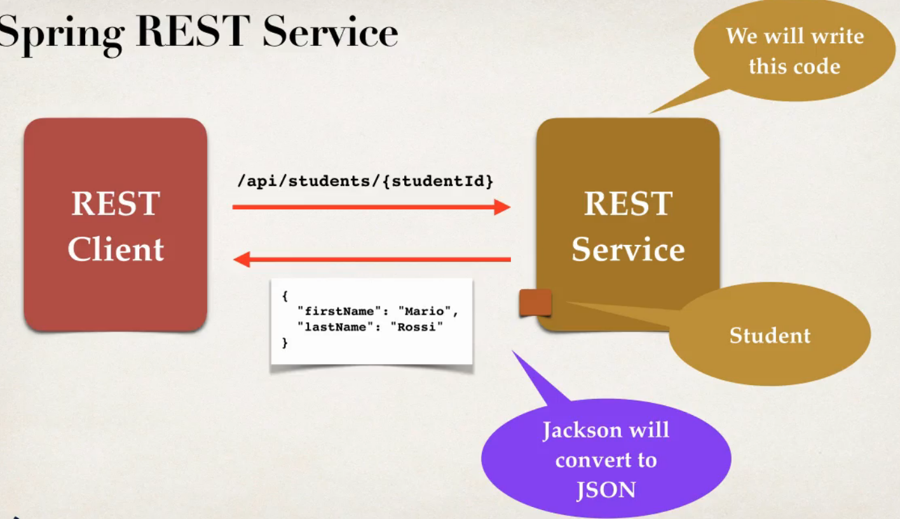

## 101. Spring Boot REST Path Variables - Overview

### Path variables 
* retrieve a single student by id :  
GET `/api/students/{studentId}`
  * `/api/students/0`
  * `/api/students/1`
  * `/api/students/2`

### Spring REST service 


### Begin the scenes 
* REST client 
* REST Service
* sequence : 
  * REST client request `api/students/{studentId}`
  * Spring REST will resoponse and return the Student
  * Jackson convert `Student JPA` to `JSON`

### Development Process
1. Add request mapping to Spring REST Service
   * Bind path variable to method parameter using `@PathVariable`
   

#### Step 1: Request Mapping 
```java
@RestController
@RequestMapping("api")
public class StudentRestController {
    
    // define endpoint for "/students/{studentId} - return student at index
    
    @GetMapping("/students/{studentId}")
    public Student getStudent(@PathVariable int studentId) {
        // create sample Students 
        List<Stduent> theStudents = new ArrayList<>();
        
        // populate theStudents 
        
        return theStudents.get(studentId); 
    }
}
```