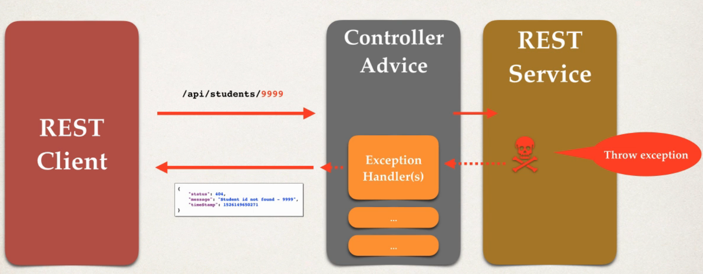
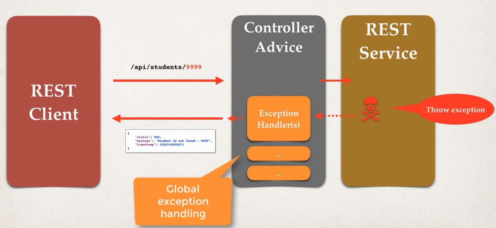

## 110. Spring Boot REST Global Exception Handling - Overview

### Spring REST Eception Handling 
1. request to cause error 
2. throw exception 
3. handled in specific **rest controller**

### It works but ...
* Exception handler code is only for the specific REST controller
* can't be reused by other controllers :-(
* We need **global** exception handlers
  * Promotes reuse
  * Centralizes exception handling 

### Sptring @ControllerAdvice
* `@ControllerAdvice` is similar to an intercepto / filter
* Pre-process requests to controllers 
* Post-process reponses to handle excpetions 
* Perfect for global exceptoin handlign 
* **Real-time use of AOP**
  * we will do this in next videos 

#### the new scenario ; 


### Development Process
1. Create new `@ControllerAdvice`
2. Refactor REST service ... remove exception handling code
3. Add exception handling code to `@ControllerAdvice`

#### Step 1: Create new `@ControllerAdvice`
_File: StudentRestExceptionHandler.java_
```java
@ControllerAdvice
public class StudentRestExceptionHandler {
    
}
```
#### Step 2: refactore StudentRestController
* remove the excpeiton handlers 

#### Step 3: add exception handler to `@ControllerAdvice`
* same code as before 
```java

@ExceptionHandler
    public ResponseEntity<StudentErrorResponse> handleException(StudentNotFoundException exc) {

        // define the response entity
        StudentErrorResponse response = new StudentErrorResponse();
        response.setMessage(exc.getMessage());
        response.setStamp(System.currentTimeMillis());
        response.setStatus(HttpStatus.NOT_FOUND.value());


        // return the response entity
        return new ResponseEntity<>(response, HttpStatus.NOT_FOUND);
    }
```

### Recap 


This is best practice in real time  and enterprise level projects
