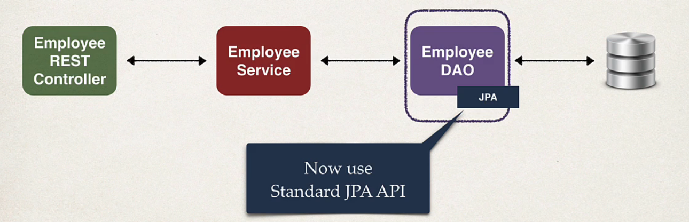

## 117. Spring Boot REST DAO

### Application Architecture 


### The remained process :
3. get list of employees
4. get single employee by id
5. add new employee
6. update an existing employee
7. delete an exsiting employee 

#### Lets build the DAO layer

#### DAO impl
```java
@Repository
public class EmployeeDAOImple implements EmployeeDAO {
    private EntityManager entityManager; 
    
    @Autowired
    public EmployeeDAOImple(EntityManager entityManager) {
        this.entityManager = entityManager; 
    }
    
    @Override 
    public List<Employee> findAll() {
        TypedQuery<Employee> theQuery = entityManger.createQuery("from Employee", Employee.class); 
        
        // execute query and get result list 
        List<Employee> employees = theQuery.getResultList(); 
        
        // return the result 
        return employees; 
    }
}
```

### Developemnt process with DAO 
1. update db config in `application.properties`
2. Create Employee entity 
3. Create DAO interface
4. Create DAO impl 
5. Create `RESTController` to use DAO 


