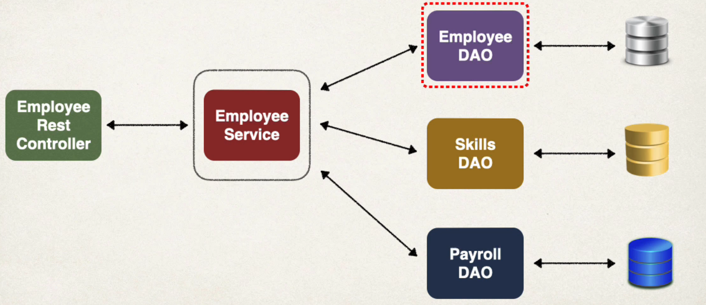

## 121. Spring Boot Define Service Layer - Overview

### Refactor: Add a Service Layer 

#### Purpose of Service Layer : 
* **Service Facade** design pattern
* Intermediate layer for custom business logic 
* Integrate data from multiple sources (DAO/repositories)




* Employee Service: Provide controller with a single view of the data that we integrate from multiple backend datasources

** Best practice in enterprise applications** 

### Specialized Annotation for Services 
* Spring provides the **@Service** annotation 

* **@Service** applied to Service implementations 
* Spring will automatically register the Service implementation 
  * thanks to component-scanning 

#### Step 1: Define Service interface 
```java
public interface EmployeeService {
    List<Employee> findAll(); 
}
```
#### Step 2: Define Service Implementation  
```java
@Service
public class  EmployeeServiceImpl implements EmployeeService {
    
    List<Employee> findAll();
    
    // inject EmployeeDAO ... 
  
    @Override     
    public List<Employee> findAll() {
        return employeeDAO.findAll(); 
    }
}
```