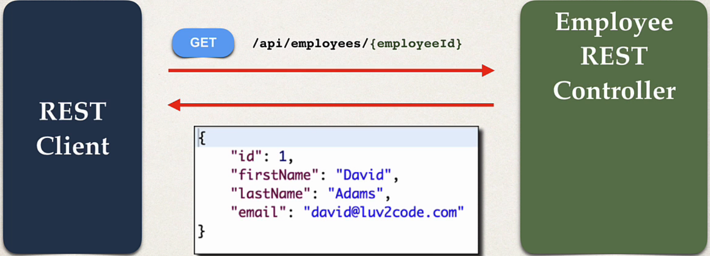
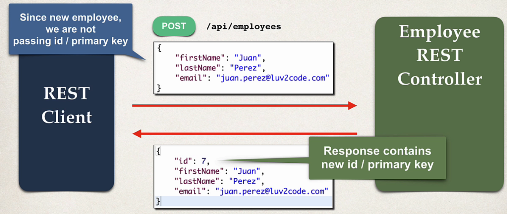

## 126. Spring Boot REST: Get Single Employee - Coding

### Rest controller methods : 
4. get single employee by id 
5. add a new employee 

### Real-Time Project
* we have completed `GET /api/employees`
* now we will focus on 
  * `GET /api/employees/{employeeId}`
  * `POST /api/employees`

#### Read a single employee 


#### Create a New Employee 


### Sending JSON to Spring REST Controllers
* When sending JSON data to Spring REST Controllers
* For controller to process JSON data, need to set a HTTP request header
  * `Content-type: application/json`
* Need to configure REST client to send the correct HTTP request 

### Postman - Sending JSON in Request Body 
* Must set HTTP request header in Postman 
* choose body 
  * choose fomrat : `JSON (application/json)`
```json
{
  "fistName": "Mohammad",
  "lastName": "Faqusa",
  "email": "mohammad@g.com"
}
```

#### Reading a single employee 
EmployeeRestController
```java
@GetMapping("/employees/{employeeId}")
public Employee getEmployee(@PathVariable int employeeId) {
    Employee theEmployee = employeeService.findById(employeeId); 
    
    if (theEmployee == null) {
        throw new RuntimeException("Employee id not found -  " + employeeId);
    }
    return theEmployee;
```

* run the application 
* check in browser and postman 


