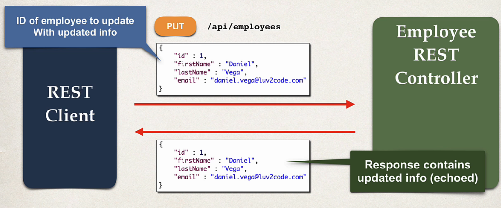
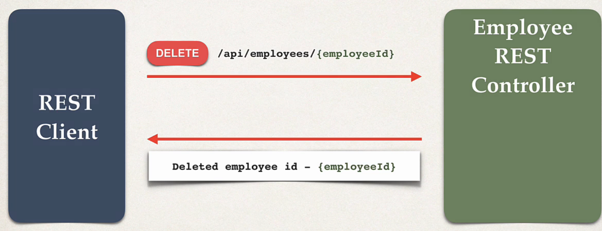

## 128. Spring Boot REST: Update Employee - Coding

### Development processs 
6. update existing employee
7. add existing employee


#### Update employee 


#### Delete Employee 


### Rest Controller 
```java

@PutMapping("/students/{studentId}")
public Employee updateEmployee(@PathVariable Employee theEmployee) {
    
    Employee dbEmployee = employeeService.save(theEmployee); 
    return dbEmployee; 
    
}
```
* run the application
* send updated data from `postmaen` , to id `1` 

