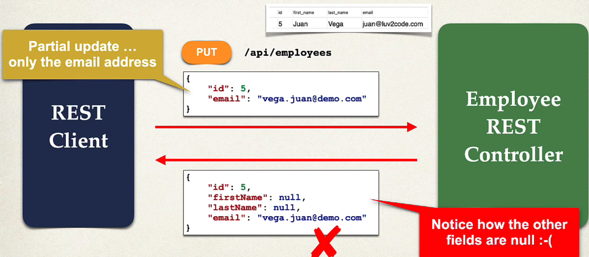
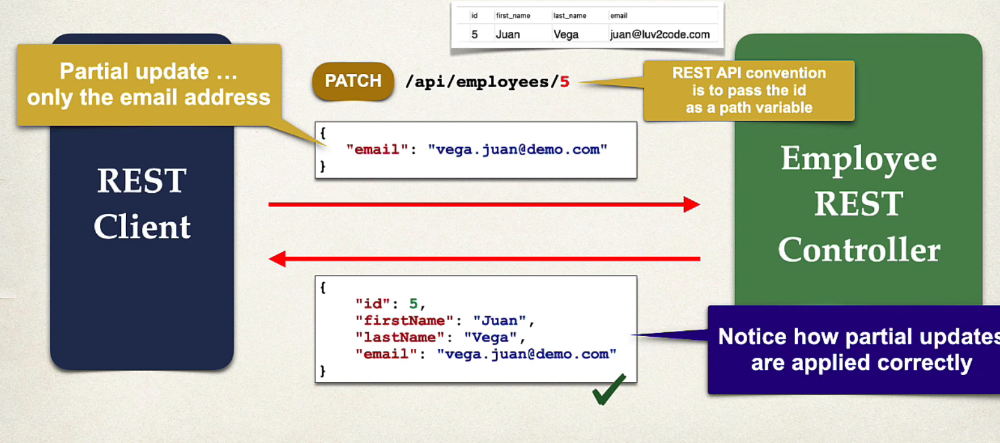

## 129. Spring Boot REST: PATCH - Overview - Part 1

### PATCH method 

#### Common Pitfall - Partial Update Employee 

#### Partial Updates - Patch 
* For partial updates , need to use HTTP PATCH
* Composition 
  * PUT: Replaces the entire resource
  * PATCH: Modifies only specified parts of resource (partial)
* Benefits : 
  * Efficiency : reducing bandwidth by sending only partial changes 
  * Flexibility: Allows multiple partial updates in a single request

