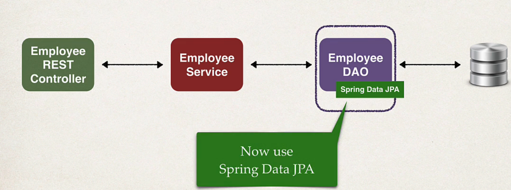
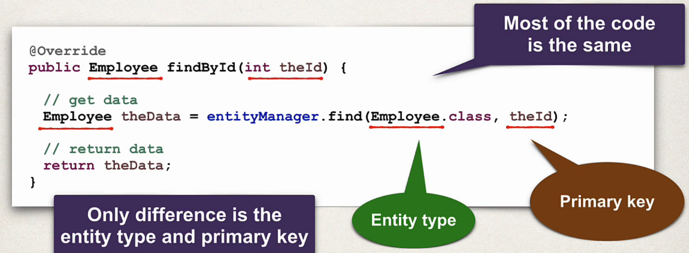
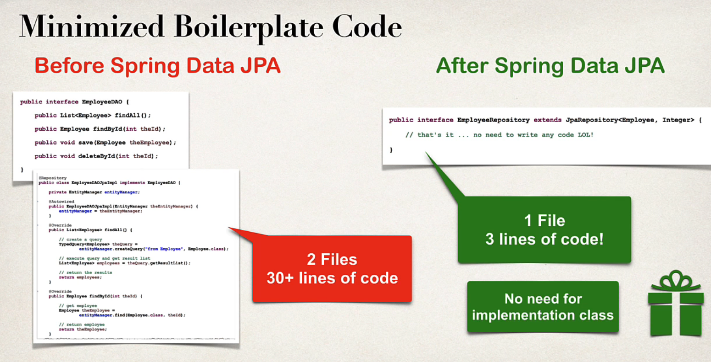

## 135. Spring Boot REST: Spring Data JPA - Overview

### Application architecture 


### The Problem 
* We say how to create a DAO for **Employee**
* What is we need to create a DAO for another entity? 
  * **Customer, Student, Product, Book...**
* Do we have to repeat all the same code again ?? 

* You may noticed the pattern 
* 

### My wish 
* I wish we could tell spring :
* Create a DAO for me 
* Plug in my entitiy type and primary key
* give me all the basic CRUD features for free 

My Wish Diagram 
* findAll()
* findById()
* save()
* others ... 

### Spring DATA JPA - Solution 
* Spring DATA JPA is the solution !!! 
* Create a DAO and jsut plug in your entity type and primary key 
* Spring will give you a CRUD implementation for FREE ... Like MAGIC
  * helps to minimize boiler-plate DAO code ... yaay!!!
  * more than **70%** reduction of code

### JpaRepository 
* String DATA JPA provices the interface: **JpaRepository**
* Exposes methods (some by inheritance from parents)
  * findAll
  * findById
  * save
  * deleteById
  * others ... 

### Develpment Process 
1. Extend **JpaRepository** interface
2. Use your Repository in your app 

#### Step 1: Extend JpaRepository interface
```java
public interface EmployeeRepository extends JpaRepository<Employee, Integer> {
    
}
```

##### JpaRepository Docs
* Full list of methods available ... see JavaDoc for **JpaRepository**

#### Step 2: Use Repository in your app 
```java
public class EmployeeServiceImpl implements EmployeeService {
    private EmployeeRepository employeeRepository; 
    
    //injection 
    @Autowired 
    public EmployeeServiceImpl(EmployeeRepository employeeRepository) {
        this.employeeRepository = employeeRepository; 
    }
}
```


### Advance Features 
* Advanced features available for 
  * Extendign and adding custom queries with JPQL
  * Query Domain Specific Language (Query DSL)
  * Defining custom methods (low-level coding) 
  * 