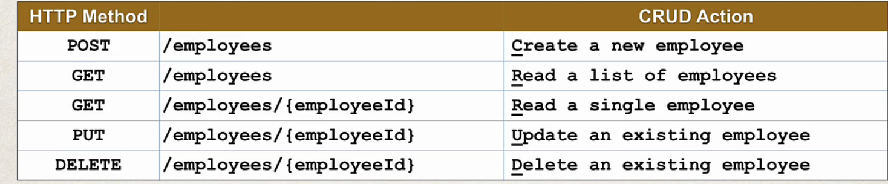
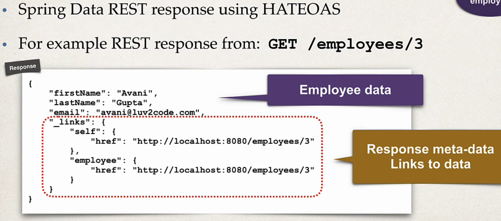
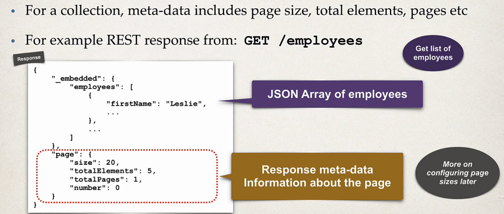

## 138. Spring Boot REST: Spring Data REST - Overview

### Spring Data JPA 
* we saw the majic of JpaRepository 
* can **same** thing apply to REST API 
* previously we have created for REST : 
  * RestController
  * RestSErvice
    * interface
    * implementation
  * what if create for another enitity ??? 
    * we dont to repeat again 

### tell to create
* use my existing `JpaRepository` and create REST API CRUD features

### Spring Data REST solution 
* **Spring DATA REST is the solution
* expose methods


### How does it work ? 
* scan for `JpaRepository`
* Expose REST APIs for entity type for your **JpaRepository**
* Simple pluralized from : 
  * first character of entity is **lower case** 
  * then just add **s** to the entity

### Development process 
1. Add Spring data REST to your Maven POM file 
```xml
<artifact>spring-boot-starter-data-rest</artifact>
```

### In A Nutshell
for Spring Data REST , you only need 3 items 
1. your entity : Employee
2. EmployeeRepository 
3. Maven POM dependency **spring-boot-starter-data-rest**

### HATEOAS 
* Spring Data REST endpoint are HATEOAS compliant 
  * **HATEOAS** : Hypermedia as the Tngine of Applicatoin State
* Hypermedia-fiven sites provide information to access REST interfaces
  * think of it as meta-data for REST data




#### advances features 
* Spring Data REST advanced reatueres 
  * paganination, sorting and searhing
  * extending and adding cutom queries iwth JPQL
  * Query Domain Specific Language (Query DSL)
