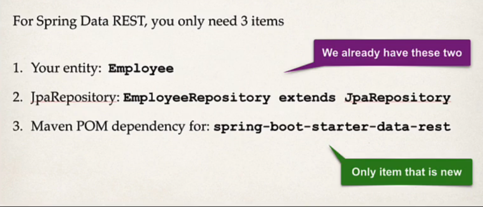

## 139. Spring Boot REST: Spring Data REST - Coding - Part 1

### The process
1. stop the application 
2. copy and paste the previous project : `40-spring-boot-rest-crud-employee-with-spring-data-rest`
3. import the project
4. applyt IntelliJ configurations 
   1. move to settings 
   2. build , exution ,  ...
   3. choose `compiler`
   4. build projets automatically
   5. back to `advanced settings`
      * allow auto make
5. open POM.xml
   * add dependency for Spring Data Rest 
   * copy and paste and update artiface to `spring-boot-starter-data-rest`
6. delete the `rest` package
7. delete the `service` package 

8. run the application and test it out 
9. 