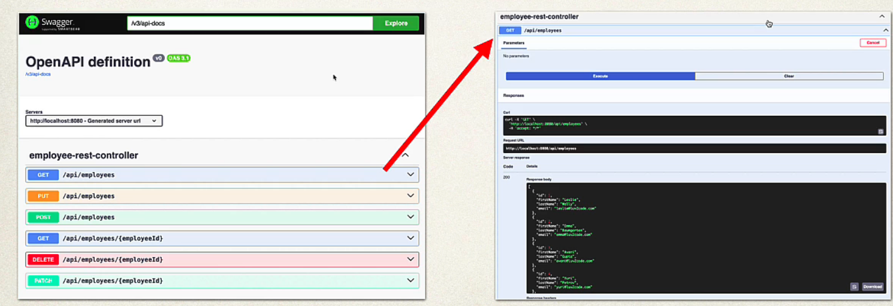

## 143. Spring Boot REST: OpenAPI and Swagger - Overview

### The Problem 
* There is a REST API out there ... but we don't have any documentation
* We have to review the source code to find  endpoints `@GetMapping` etc
* Then use Postman or curl to call the REST API

### My Wish
* at run time generate the API documentation 
* Inspect API endpoints based on Spring Configs, annotation etc
* Provide a web UI for accessing endpoints, No need for Postman

### SpringDoc to The Rescue 
[www.springdoc.org](www.springdoc.org)
* Springdoc is separate open-source project
* Generates API documentation 
* Inspect API endpoints based on Spring Configs, annotations etc
* Provides a web UI for accessing endpoints 
  * No need for Postman 

#### Springdoc - Swagger Web UI
* Springdoc provides a **Sweager** web UI for accessing endpoints 


### Documenting REST APIs
* OpenAPI is an industry standard format for documenting APIs
  * www.openapis.org
* Swagger UI is a browsser-based UI for interacting with your API
  * Powerred by Springdoc-OpenAPI

### Development Process 
1. Add maven dependency for Springdoc
2. Access Swagger UI
3. Retrieve API endpoints as JSON or YAML

#### Step 1: Add maven dependency for Springdoc
```xml
<dependency>
    <groupId>org.springdoc</groupId>
    <artifactId>springdoc-oepnapi-starter-webmvc-ui</artifactId>
    <version>s.y.z</version>
</dependency>
```
* [www.springdoc.org](www.springdoc.org)

#### Step 2: Access Swagger UI
* By default, Swagger UI is availabe at: 
  * [http://locahost:8080/swagger-ui/index.html](http://locahost:8080/swagger-ui/index.html)

##### Configure Custom path for swagger UI 
* can configure a custom path in `application.properties`
```python
springdoc.swagger-ui.path=/my-fun-ui.html
```
* Acess swagger UI at 
  * [http://localhost:8080/my-fun-ui.html](http://localhost:8080/my-fun-ui.html)

#### Step 3: Retrieve API endpoints as JSON or YAML
* Docs for API endpoints availabe as JSON or YAML
* Useful for integration with other development tools 
* Client SDK generation, API mocking, contract testing, etc
* JSON or YAML is language independent 
* Can be processed by Python, Javascript, Go, C# etc 
* By default, **JSON** docs availabe here 
  * `http://localhost:8080/v3/api-docs`
* **YAML** docs availabe here  :
  * `http://localhost:8080/v3/api-docs.yaml`
  * Web browser will download the YAML file 
  * You can view it with any text editor 

##### Confugure Custom Path For API docs 
* Can configure a custom path in `application.properties`
```python
#configure custom path
springdoc.api.path=/my-api-docs 
```
# Access API Docs at 
* `http://localhsot:8080/my-api-docs`
* `http://localhsot:8080/my-api-docs.yaml`

