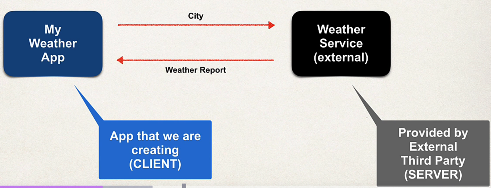

## 89. What Are REST Services - Part 1

### You will learn how to 
* Create REST APIs / Web Services with Spring
* discuss REST concepts, JSON and HTTP messaging 
* Install REST client tool: Postman 
* Develop REST APIs / Web Services with @**RestController**
* Build a CRUD interface to the database with Spring REST

### Practical Results 
* Introduction to Spring REST development 
* Not an A to Z reference ... for that you can see **Spring reference manual**  
by following the link : (www.luv2code.com/spring-reference-manual)[www.luv2code.com/spring-reference-manual]

### Business Problem 
* Build client app that provides weather report for a city
* need to get wheather data from external services 

### Application architecture 

### Questions 
* How will connect to the Weather Service ? 
* What programming language to use ? 
* what is the data format ? 

### Answers : 
* How will we connect to the Weather Service? 
  * We can make REST API calls over HTTP
  * REST: REpresentational State Transfer 
  * lightweigh approach for communicating between applications 
* What programming language do we use ? 
  * REST is language independent 
  * The client application can use ANY programming language
  * the **server** application can use **ANY** programming language 
* What is the data format ? 
  * REST applicaitons can use any dataforamt
  * Commonly use JSON or XML
  * JSON is most popular
    * JavaScript Object Notation 

### Possible Solution 
* Use online Weather Service API provided by : [openweathermap.org](openweathermap.org)
* Provide weather data via an API
* Data is available in mulitple formats : JSON, XML etc ... 

#### Call weather Service 
* The API documentation gives us the following 
  * Pass in the latitude and longitude for your desired location 

### Multiple Client Apps
* we can create multiple clients with multiple types : 
* using 
  * Spring MVC
  * C# App
  * iPhone App
  * etc 

** Remember** : 
* REST call over HTTP
* REST is languate independent 

