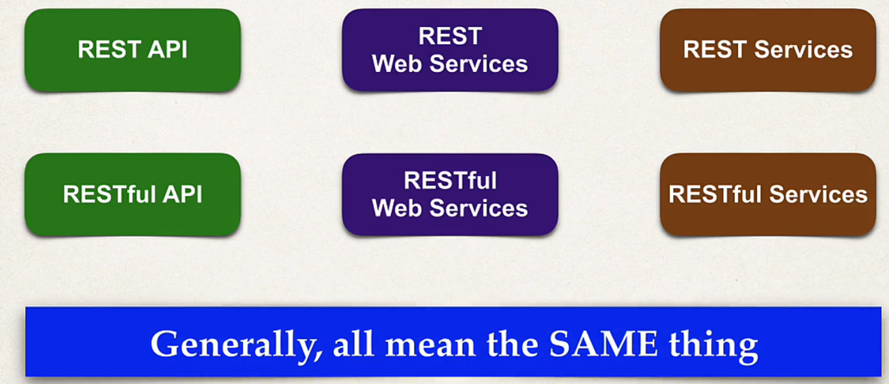

## 90. What Are REST Services - Part 2

### Currency Converter App
* client : my currency app
* server : currency service (external)
* input : USD, output : INR

### MOvie Tickets Apps 
* client : movie app 
* server : movie tichets 
* input : movie, locaiton , time . output : Movie Results 

### Customer Relationship Manager (CRM) app
* CRM App (client)
* server : CRM service (spring-rest)
* input : Get customers , output: customer list

* we will create this server in the course 

### What do we call it? 

