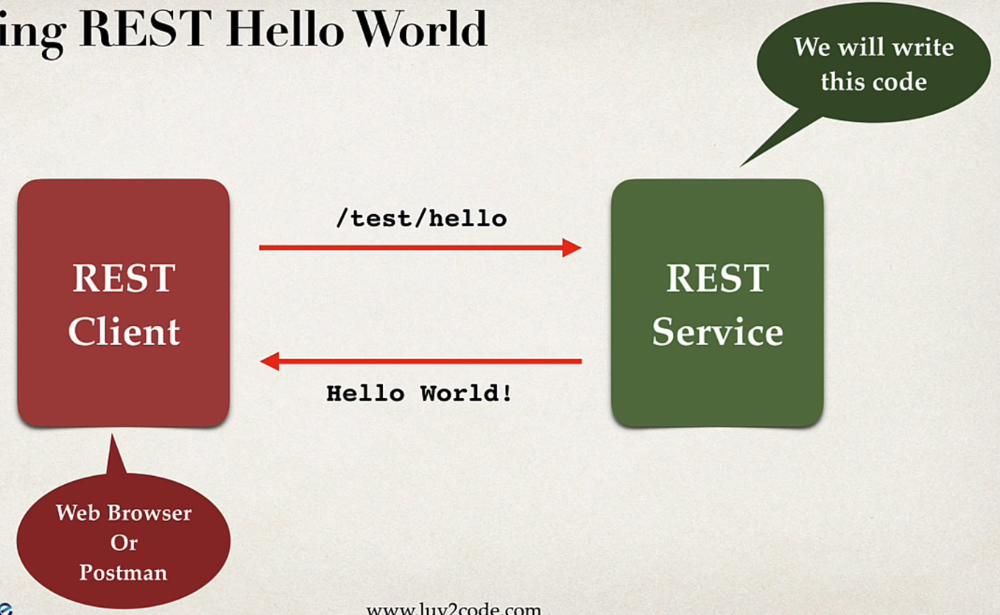

## 94. Spring Boot REST Controller - Overview - Part 1

### Spring REST Hello World example 


```java
@RestController
@RequestMapping("/test")
public class DemoController{
    
    @GetMapping("/hello")
    public String sayHello() {
        return "Hello World!"; 
    }
    
}
```
* `@RestController` : Adds REST support 
* `@GetMapping("/hello")`: Access the REST endpoint at `test/hello`
* `return "Hello Wordl"`: Returns content to client 

### Testing with REST Client - Postman 
* GET request : `http://localhost:8080/spring-rest-demo/test/hello`
* the response : `Hello World`

### Web browser vs Postman 
* for simple REST testing for GET request : 
  * the are same 
* for advances 
  * postmane is better 
    * POST , PUT ... 
    * Posting JSON data, setting content type 
    * passing HTTP request headers, authintication etc... 

