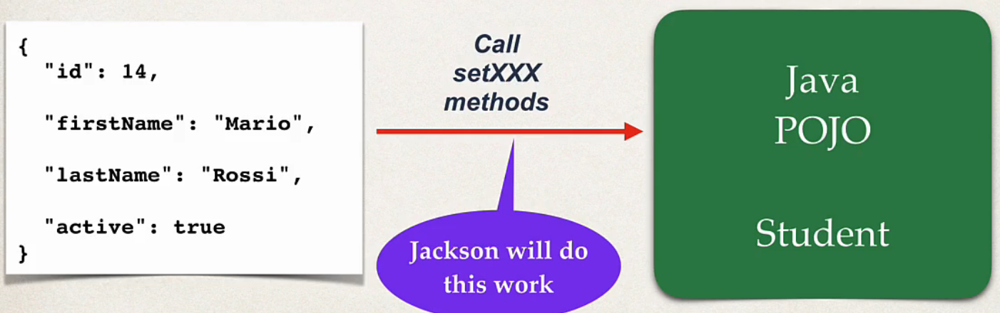
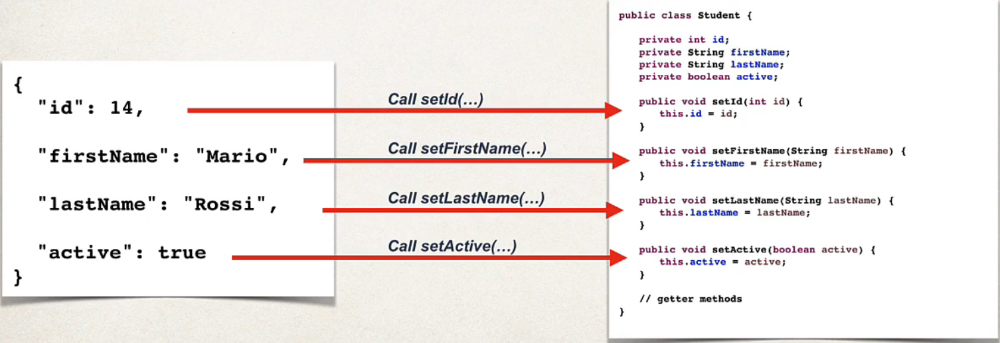
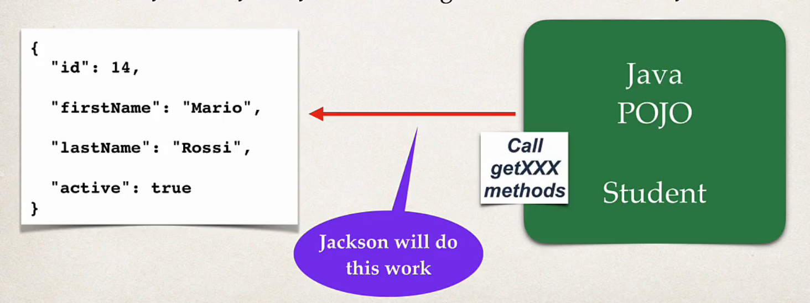

## 97. JSON Jackson Data Binding

### JAVA JSON Data Binding 
* Data binding is the process of **converting** `JSON` data to a Java `POJO`
* also known as : 
  * Mapping
  * Serialization / Deserialization 
  * Marshalling / Unmarshalling 


### JSON Data Binding with Jackson
* Spring uses the **Jackson Project** behind the scenes 
* Jackson handles data binding between JSON and Java POJO
  * **Spring Boot Sterter Web** automatically includes dependency for `Jackson`
* Details on Jackson Project: 
  * is seperate project from spring, doing for **data binding**
  * [https://github.com/FasterXML/jackson-databind](https://github.com/FasterXML/jackson-databind)
* By default, Jackson will call appropriate getter/setter method 
* for example : 
    * we have JSON object in one side
    ```json
    {
      "id": 14,
      "firstName": "mohammad",
      "lastName": "faqusa",
      "active": true
    }
    ```
  * and in other side : **Java POJO** (Student) 
  * will do the conversion between them 
  
#### JSON to Java POJO
* Convert JSON to Java POJO ... call setter methods on POJO


* Convert JSON to Java POJO .. call setter methods on POJO
  * Jackson will call the setters methods on POJO



#### Java POJO to JSON 
* jackson will call the **get methods** 


### Spring and Jackson Support 
* when building Spring REST applications 
* Spring will automatically handle Jackson Integration 
* JSON data being passed to REST controller is converted to POJO
* Java object being returned from REST controller is converted to JSON 

