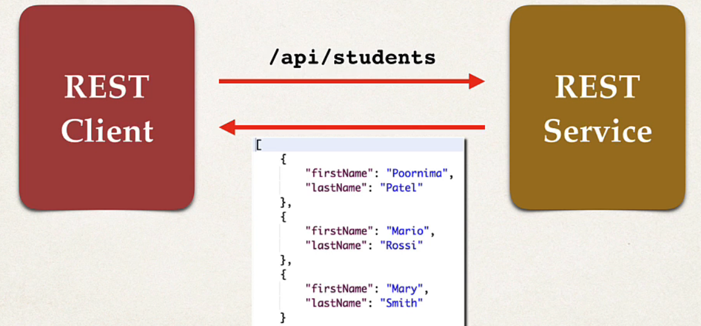
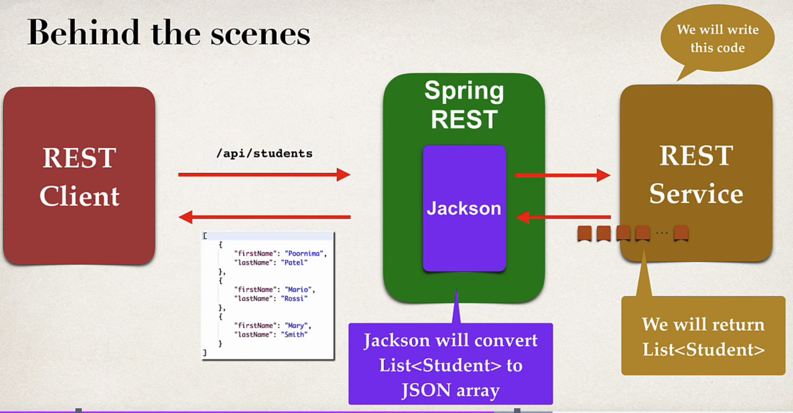

## 98. Spring Boot REST POJO - Overview

### Create a New Service 
* Return a list of students 
  * GET `/api/students` : _Returns a list of students_


### Convert Java POJO to JSON 
* Our REST service will reutrn List<Student> 
* need to convert List<Student> to JSON
* **Jackson** helps us to do this 

### Spring Boot and Jackson Support 
* Spring boot automatically handle **Jackson** integration
* JSON data being passed to REST controller is converted to JAVA POJO
* Java POJO being returned from REST controller is converted to JSON 

### Student POJO (class) 
* fields : firstName, lastName, 
* setters/getters 

### Jackson Data Binding 
* Jackson calls getters and setters methods for **conversion**

### Spring REST service : 
* jacksong will convert `List<Student>` to **JSON Array** 

### Behind the scences 



### Development Process
1. Create POJO class for Student 
```java
public class student { 
    private String firstName ;
    private String lastName; 
    
    // constructor
    
    // setters/getters 
    
}
```
2. Create Spring REST service using @**RestController** 
```java
@RestController
@RequestMapping("/api")
public class StudentRestController{
    
    @GetMapping("/students")
    public List<Student> getStudents() {
        List<Student> theStudents = new ArrayList<>();
        
        theStudents.add(new Student("Mohammad", "faqusa")); 
        theStudents.add(new Student("ahmad", "faqusa")); 
        theStudents.add(new Student("ali", "faqusa")); 
        
        return theStudents; 
        
    }
}
```