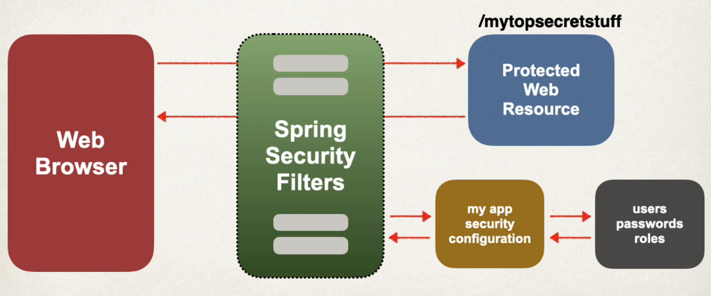
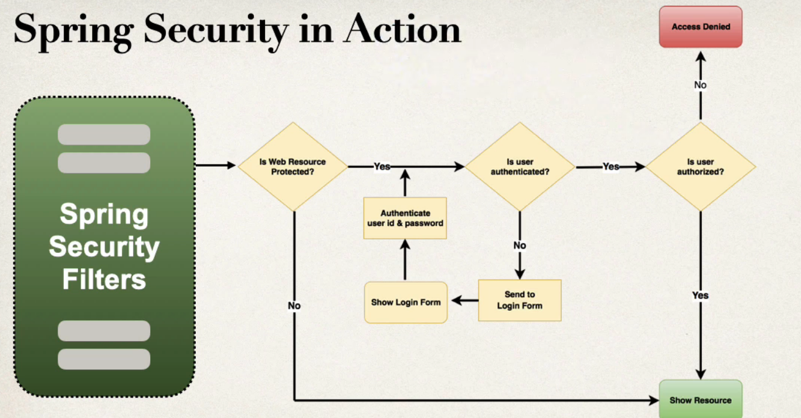

## 149. Spring Boot REST API Security Overview


### You will learn how to ...
* Secure Spring Boo REST APIs
* Define users and roles 
* Protect URLs based on role 
* Store users, passwords and roles in DB (plain-text -> encrypted)


### Practical resutls 
* Cover the most common Spring security tasks that you will need on daily projects
* Not an A to Z reference ... for that you can see **Spring Security Reference Manual** 
  * [http://www.luv2code.com/spring-security-reference-manual](htttp://www.luv2code.com/spring-security-reference-manual)

### Spring Security Model 
* Spring Security defines a framework for security 
* Implemented using Servlet filters in the background 
* Two methods of securing an app : declarative and programmatic 

### Spring Security with Servlet Filters 
* Servlet Filters are used to pre-process / post-process wev requests 
* Servlet Filters can route web requests based on security logic 
* Spring provides a bulk of security funcitonality with servlet filters 

### Spring Security Overview 


#### Spring Security in Action 


### Security Concepts 
* Authentication 
  * Check user id and password with credentials in app / db
* Authorization 
  * Check to see if user has an authorized role 

#### Declarative Security 
* Define application's security constraints in configuration 
  * All Java config : `@Configuration`
* Provides separation of concerns between application code and security 

#### Programmatic Security 
* Spring Security provides an API for custom application coding 
* provides greater customization for specific app requirements 

### Enabling Spring Security 
1. add the dependency in **pom.xml**  
`spring-boot-starter-security`
2. this will automatically secure all endpoints for application 

### Secured Endpoints 
* Now when you access your application 
* Spring Security will prompt for login 

### Spring Security configuration 
* You can override defualt username and generated password 
```jupyter
spring.security.user.name=scott
spring.security.user.password=tiger
```

### Authentication and Authorization 
* In-memory 
* JDBC 
* LDAP 
* Custom / Pluggable 
* others ... 

** We will cover password storage in DB as plain-text AND encrypted** 


