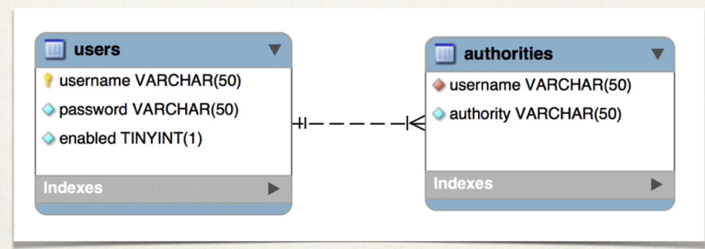

## 161. Spring Boot REST API Security - JDBC Authentication - Plain Text - Overview

### Database Access
* So far, our user accounts were hard coded in Java soruce code
* We awant to add ddatbase access (advanced feature of security)

#### REcaull OUr user roles 
simplpy put the info. in database 

| User Id | password | roles                   |
|---------|----------|-------------------------|
| john    | test123  | Emloyee                 |
| mary    | test123  | Emloyee, MANAGER        |
| susan   | test123  | Emloyee, MANAGER ,ADMIN |

### Data base spring security 
* spring security can read user account info from database
* by defualt, you ave to follow Wpring Seucrity`s predeffined table schemas 


### Customize Database Access with Spring Security 
* Can also cusotmize tha tabel schmas 
* useful if you have custom tables specific to your project / custom
* You will be responsible for developing the code to access the data
  * JDBC, JPA/hibernate etc...

### Database support in spring security 
* Follow Spring Security's predefined table schemas 
* given ready code functionality 


### Devlopment process 
1. Develop SQL script to set up database tables 
2. add database support to Maven POM 
3. Create JDBC properties 
4. Update Spring Configuration to use JDBC 

#### Default spring security database schema 

* authorites : roles 

##### Step1 : Develop SQL Script to setup database talbes 
```sql
CREATE TABLE `users` (
    `username` varchar(50) NOT NULL,
    `password` varchar(50) NOT NULL,
    `enabled` tinyint NOT NULL,
    
    PRIMARY KEY (`username`)
) ENGINE=InnoDB DEFAULT CHARSET=latin1; 
```
* insert the users : 
  * john, test123, 1 
  * mary, test123, 1 
  * susan, test123, 1 

* now create table of Authorities 
```sql
CREATE TABLE `authorities` (
    `username` varchar(50) NOT NULL, 
    `authority` varchar(50) NOT NULL, 
    
    UNIQUE KEY `authorities_idx_1` (`username`, `authority`),
    
    CONSTRAINT `authorities_ibfk_1`
    FOREIGN KEY (`username`)
    REFERENCES `users` (`username`)
                        
) ENGINE=InnoDB DEFAULT CHARSET=latin1; 

INSERT INTO `authorities`
VALUES 
('mohamamd', 'ROLE_EMPLOYEE'),
('ALI', 'ROLE_MANAGER'),
('ahmad', 'ROLE_ADMIN')
```

#### Step 2: Add database driver to maven file 
* postgres 

#### Step 3: Create JDBC properties file 
`applicaiton.properties`
url
username
passsword 

#### Step 4: Update Spring Security to use JDBC 
* inject the datasoruce 
* use `JdbcUserdetialsManager(dataSource)` 
  * JDBC authintication 
  * No longer hard coding the users 
* 