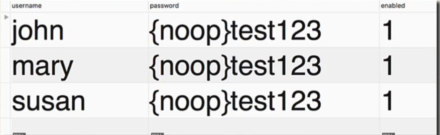

## 165. Spring Boot REST API Security - BCrypt Encryption - Overview - Part 1

#### Password Storage 
* So far, our user passwords are stored in plaintext ... yikes!
* 
* Ok for getting started ... but not for production / real-time project !

#### Best procatice - store en encrypt format
 
#### Spring Security team recommendation 
* Spring security recommends using the popular **bcrypt** algorithm
* bcrypt 
  * Perfomrs one-way encrypted hashing 
  * adds a random salt to the password for additional protection 
  * includes support to defeat brute force attacks 

#### Bycrypte Additional Information 
* Why you should use bcrypt to hash passwords  
[www.luv2code.com/why-bcrypt](www.luv2code.com/why-bcrypt)
* Detialed bcrypt algorithm analysis
  [www.luv2code.com/bcrypt-wiki-page](www.luv2code.com/bcrypt-wiki-page)
* Password hashing - Best practices  
  [www.luv2code.com/password-hashing-best-practices](www.luv2code.com/password-hashing-best-practices)

#### How to Get a Bcrypt password
You have a plaintext password and you wnat ot encrypt using bcrypt 
* Option 1: Use a website utility to perfom the encryption 
* Option 2: Write Java code to perform the encryption 

##### Get encrypt from Website 
* visit : [www.luv2code.com/generate-bcrypt-password](www.luv2code.com/generate-bcrypt-password)
* note : mutliple trys generate different passwords **due to ** random  **salting** 

