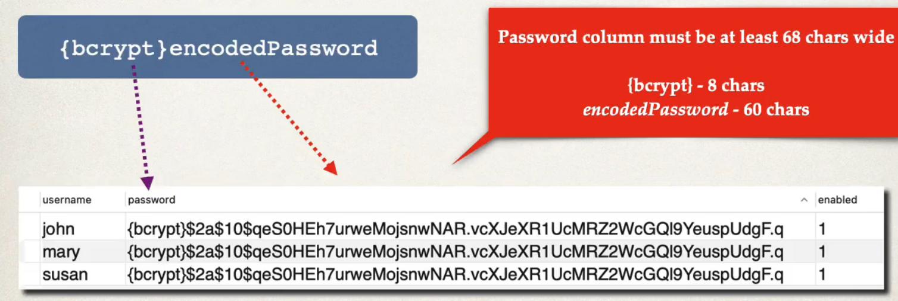
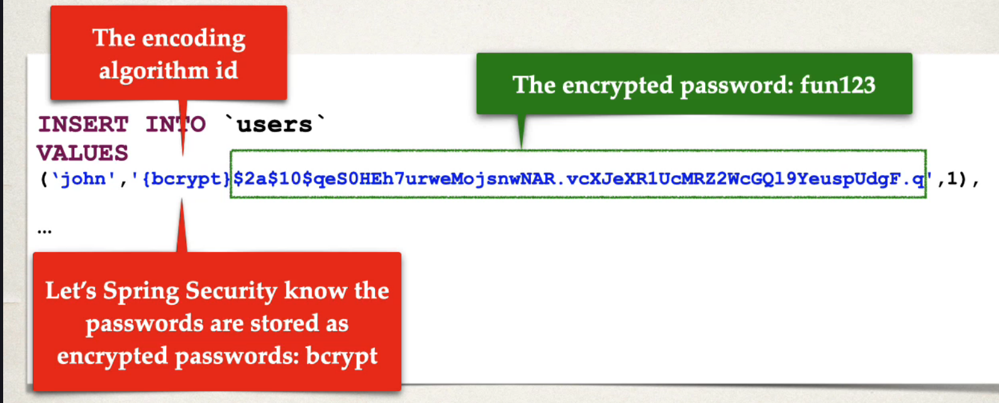

## 166. Spring Boot REST API Security - BCrypt Encryption - Overview - Part 2

### Development Process 
1. Run SQL Script that contains encrypted passwords
   * Modify DDL for password field, length should be 68
2. no need to change the java source code 

#### Spring Security , passwords are stoted using a specific format 


```mysql
CREATE TABLE `users` (
  `username` varchar(50) NOT NULL,
  `password` varchar(68) NOT NULL,
  `enabled` tinyint NOT NULL,
  PRIMARY KEY (`username`)
) ENGINE=InnoDB DEFAULT CHARSET=latin1;
```

##### Step 1: Develop SQL Script to setup database talbes
```mysql
INSERT INTO `users`
VALUES
('john', `{bcrypt}3242340923jfdsksdfdsffasifiwue0230`)
```


#### Spring Security Login Process : 
1. retrieve password from db for the user 
2. read the encoding algorith id `bcrypt etc`
3. for case of **bcrypt** , encrypt plaintext password from login form (using salt from db password)
4. compare encrypted passwrod from login form with encrypted password from db 
5. if there is match, successful 
6. not match , login fail 

