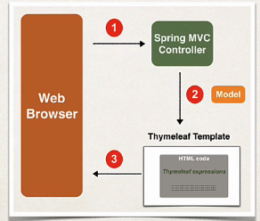
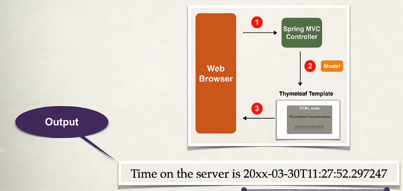

## 173. Spring Boot - Spring MVC with Thymeleaf - Overview
### what is thymeleaf 
* thymeleaf is a java templating engine 
* commonly used fto generate **HTML** view for web apps 
* however, it is a general purpose templating engine 
  * can use thymeleaf outside of web apps (more on this later)


### What is thymleaf tempalte : 
* can be an html page iwth some thymealeaf expressions
* include dynamic content form thyemleaf expression 
  * access java code, spring beans 

### Where is the thymeleaf template prcessed ? 
* In a web app, thymeleaf is processed on the server 
* Reuslts included in HTML returned to browser 
* 

### Thymeleaf demo : 



### Development process 
1. add thymeleaf to Maven POM file 
2. develop spring MVC controller 
3. create thymeleaf template 

#### Step 1: add thymeleaf to Maven POM file 
* artifactId: `spring-boot-starter-thymeleaf`
* also you can add it via starter 
* there is no additional configuration to setup 


#### Step 2: develop spring MVC controller 
file : `DemoController.java`
```java
public class DemoController {
    @GetMapping("/")
    public String sayHello (Model theModel) {
        theModel.addAttribute("theDate", java.time.localDateTime.now());
        return "helloworld";
    }
}
```

#### Step 3: where to place Thymeleaf template ? 
* In Spring Boot, your thymeleaf template files go in 
  * src/main/reosurces/templates 
* for web apps , thymeleaf templates have a .**html** extension 

```html
<html xmlns:th="http://www.thymeleaf.org">
<head></head>
<body>
<p th:text="`Time on the server is ` + ${theDate}"/> 
</body>
</html>
```
* `<html xmlns:th="http://www.thymeleaf.org">` to use Thymeleaf expressions 
* where we get `theDate`
  * actionally from DemoController `theModel.addAttribute("theDate", java.time.localDateTime.now());
`

### Additional features 
* looping and conditionals 
* CSS and JavaScript integration 
* Template layouts and fragments 
* for more : [www.thymeleaf.org](www.thymeleaf.org)

