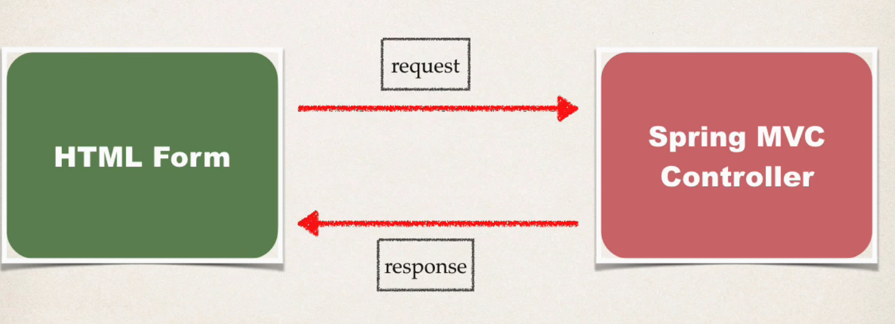
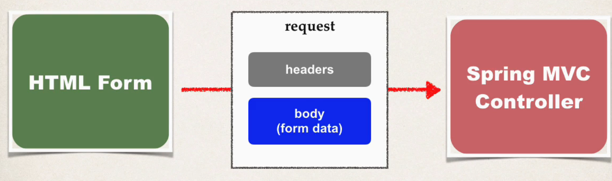

## 187. Spring Boot - GetMapping and PostMapping - Overview

### HTTP Request/Response 



### most commonly used HTTP methods : 
* GET
* POST

### SEINDING DATA WITH GET METHOD 

```html
<form th:action="@{/processForm}" method="GET" ></form>
```
* form data is added to end of URL as name/value paris 
  * `theUrl?field1=value&field2=vlue2...`

#### Handling Form Submission 
```java
@RequestMapping("/processForm")
public Stirng processForm() {
    
}
```
* This mapping handles **ALL HTTP** methods 
  * get, post, etc 

#### Constrain the REquest Mapping = GET 
```java
@RequestMapping("/processForm", method=RequestMethod.GET)
public Stirng processForm() {
    
}
```
#### Annotation Shor-Cut 

```java
@GetMapping("/processForm")
public Stirng processForm() {
    
}
```
* @GetMapping: this mapping **ONLY** handles **GET** method 
* any other HTTP REQUEST method will get rejected 

#### Sending Data with POST method 
```html
<form th:action="@{/processForm}" method="POST" ></form>
```
* Form data is passed in the body of HTTP request message 


```java
@RequestMapping("/processForm", method=RequestMethod.POST)
public Stirng processForm(....) {
    
}
```
##### Annotaiton short=cut
```java
@PostMapping("/processForm", method=RequestMethod.POST)
public Stirng processForm(....) {
    
}
```

### Well, which one ? ?? 
| GET                       | POST                          | 
|---------------------------|-------------------------------|
| Good for debuggin         | Can't bookmark or email URL   |
| Bookmark or email URL     | No limitations on data length |
| Limitations on data length | Can also send binary data     |

