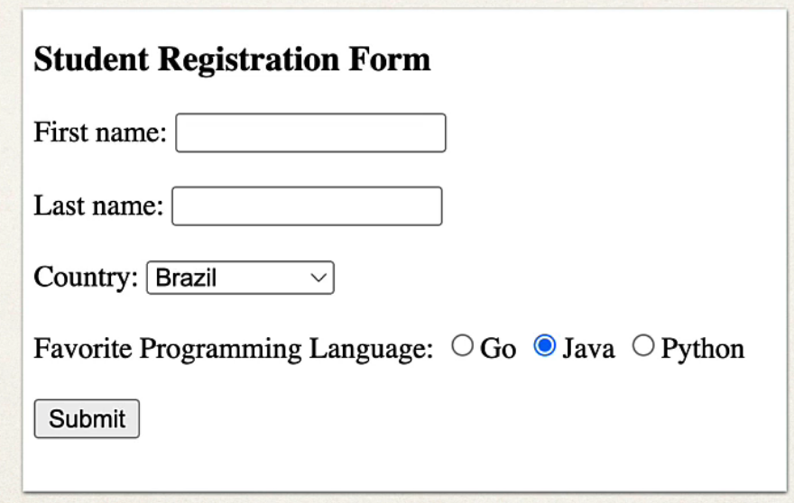

## 197. Spring Boot - Spring MVC Form Data Binding - Radio Buttons - Overview

### Radio buttons 


### Code Example : 

```html
<input type="radio" th:field="*{favoriteLanguage}" th:value="Go">Go</input>
<input type="radio" th:field="*{favoriteLanguage}" th:value="Java">Java</input>
<input type="radio" th:field="*{favoriteLanguage}" th:value="c">c++</input>
```

### Development Process 
1. Update HTML form 
2. Update Student class - add getter/setter for new property
3. Update confirmation page 