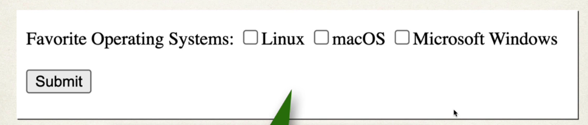
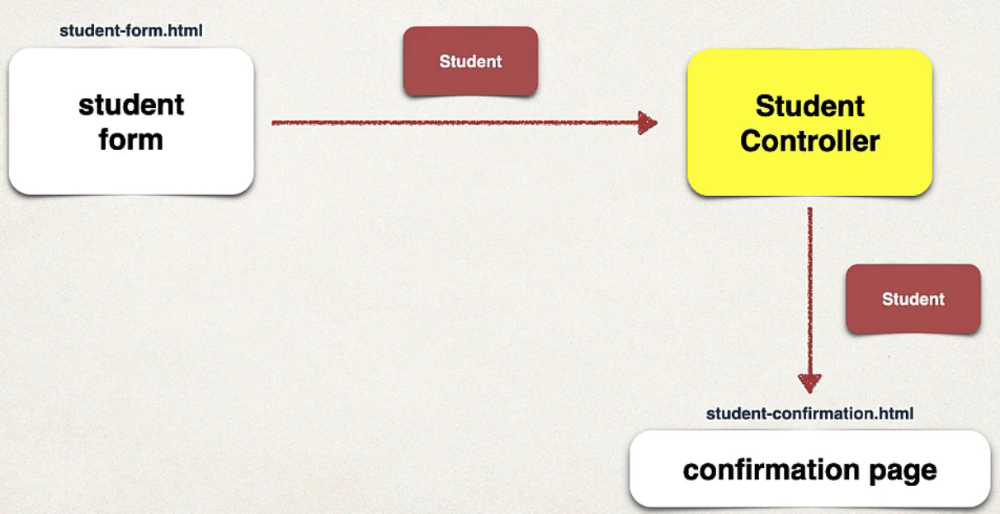

## 200. Spring Boot - Spring MVC Form Data Binding - Check Boxes - Overview

#### Ceck Box - Pick Your Favorite Operating System 

* user can make mulitple selections 


```html
<input type="checkbox" th:field="*{favoriteSystems}" th:value="Linux">Linux<input/>
<input type="checkbox" th:field="*{favoriteSystems}" th:value="Linux">Linux<input/>
<input type="checkbox" th:field="*{favoriteSystems}" th:value="'Microsoft Windows'">Microsoft Windodws<input/>
```

* notice that `Microsoft Windows` is arounded with **single quotes** becuase more than **word**

#### Putting All together : 



### Development Process 
1. Update HTML form 
2. update sudent class - add getter/setter for new property 
3. update confirmation page 

